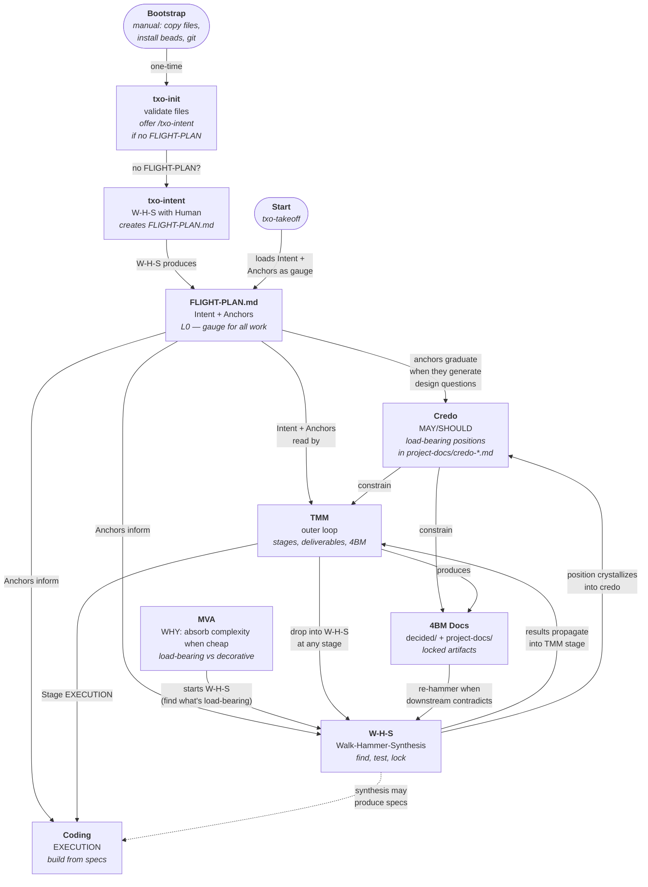
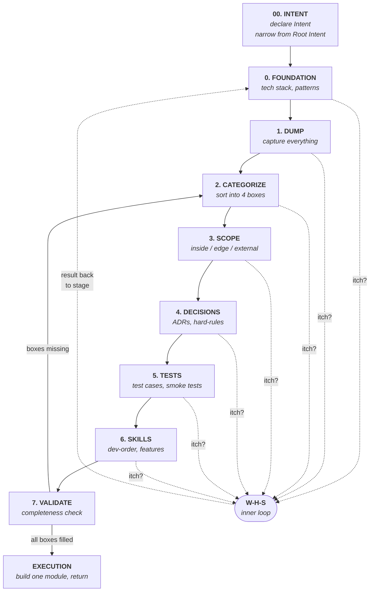

# Upstream-Downstream Flow

**Version**: 1.3
**Created**: 2026-02-19
**Purpose**: How FLIGHT-PLAN, Credo, MVA, W-H-S, TMM, and Coding relate. Load for orientation.

---



---

## Reading the Graph

- **Bootstrap** is manual and one-time: copy files from txo-ai, install beads, set up git.
- **txo-init** validates bootstrap. If no FLIGHT-PLAN.md exists, offers `/txo-intent`.
- **txo-intent** runs a W-H-S process with the Human to extract Intent and Anchors, producing FLIGHT-PLAN.md.
- **FLIGHT-PLAN.md** is the L0 Anchor document — carries Intent (the gauge) and Anchors (load-bearing philosophical
  positions). Anchors inform all downstream work: TMM stage decisions, W-H-S direction, and coding choices.
- **Credo** (MAY/SHOULD) — a load-bearing philosophical position that constrains downstream design. Appears when
  ontological ambiguity exists (things shift shape, Eidos must be found). An anchor in FLIGHT-PLAN *graduates* into a
  credo when it generates enough design questions to fill a document. W-H-S may also crystallize positions directly into
  credos. AV-R serves as compass — separating AV vs R so the designer knows which realm they're in. Lives in
  `project-docs/credo-*.md`. See tmm-0-foundation §5 for full explanation.
- **MVA** motivates W-H-S — you walk to find what's load-bearing before it calcifies.
- **W-H-S** and **TMM** are circular: TMM is the outer loop (stages), W-H-S is the inner loop (measurement events). At
  any TMM stage, drop into W-H-S. Results flow back.
- **4BM Docs** are TMM's locked artifacts. When downstream work (coding, new W-H-S) contradicts them, they get
  re-hammered.
- **Coding** is downstream of TMM EXECUTION stage. W-H-S synthesis may also produce specs directly (dashed line — less
  common).

## The Circular Relationship

```
TMM Stage N → itch detected → W-H-S begins
    Walk → Hammer → Synthesis → result
        → propagates back into TMM Stage N (or earlier — backward force)
            → may invalidate 4BM docs → re-hammer
```

This is the upstream effect problem (Anchor 5, task v86). Currently handled manually by Human noticing.

---

## TMM Stage Flow (outer loop)



At any stage, an itch triggers a W-H-S (dashed lines). The W-H-S result propagates back — possibly to the same stage, possibly to an earlier one (backward force). Stage 00 (Intent Declaration) added in TMM v0.7.

---

## Document Map

| Position | Document                     | What it carries                                     |
|----------|------------------------------|-----------------------------------------------------|
| -1       | bootstrap-ai-in-repo v1.2    | Manual setup steps (one-time)                       |
| 0a       | txo-init (skill)             | Validate bootstrap, offer /txo-intent               |
| 0b       | txo-intent (skill)           | W-H-S process to create/improve FLIGHT-PLAN.md      |
| 0c       | FLIGHT-PLAN.md               | Intent + Anchors (L0 gauge for all work)            |
| 0d       | Credo docs (MAY/SHOULD)      | Load-bearing positions, graduated anchors            |
| 1a       | Shaw Research v2.0           | W-H-S process behavior (prompt for AI)              |
| 1b       | MVA v2.0                     | WHY — motivation, load-bearing vs decorative        |
| 1c       | Walk Reference v1.0          | Shaw Dense terminology + tips                       |
| 2        | TMM Process v0.7             | Outer loop stages with Intent + W-H-S awareness     |
| 3        | 4BM Docs                     | decided/ + project-docs/ (locked per stage)         |
| 4        | Code                         | src/ (EXECUTION)                                    |

---

**Version History**

**v1.3** (2026-03-06):

- Re-added Credo as separate node between FLIGHT-PLAN and TMM/4BM docs
- v1.2 absorption was premature — credos are distinct from FLIGHT-PLAN anchors (they graduate when generating design questions)
- Added W-H-S → Credo edge (positions crystallize into credos)
- Added Credo → TMM and Credo → 4BM Docs edges (credos constrain downstream)
- Document Map: added position 0d for Credo docs
- Full credo explanation in tmm-0-foundation v0.9 §5

**v1.2** (2026-02-21):

- Removed Credo as separate node — absorbed into FLIGHT-PLAN.md Intent (reversed in v1.3)
- FLIGHT-PLAN.md now shows "Intent + Anchors" (L0 Anchor document)
- Added txo-intent node (W-H-S skill that produces FLIGHT-PLAN.md)
- Updated txo-init to offer /txo-intent instead of template copy
- txo-takeoff loads Intent + Anchors as gauge
- Anchors feed into TMM, W-H-S, and Code (replaced Credo vocabulary role)
- Document map updated with txo-intent at position 0b

**v1.1** (2026-02-19):

- Added Bootstrap → txo-init → FLIGHT-PLAN.md init chain to main diagram
- Added FLIGHT-PLAN.md as Root Intent carrier in document map
- Updated "Reading the Graph" with init layer
- Document map expanded with positions -1, 0a, 0b

**v1.0** (2026-02-19):

- Initial flow diagram from session 4 of Post Quantum-Eidos Upstream walk
- Shows Credo → W-H-S/TMM circular → 4BM → Code pipeline
- Documents the upstream effect problem (TMM ↔ W-H-S circular, 4BM re-hammer)