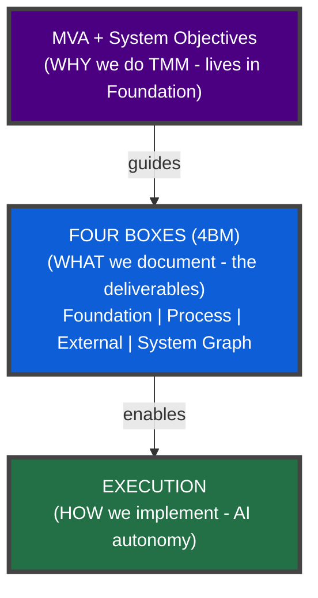
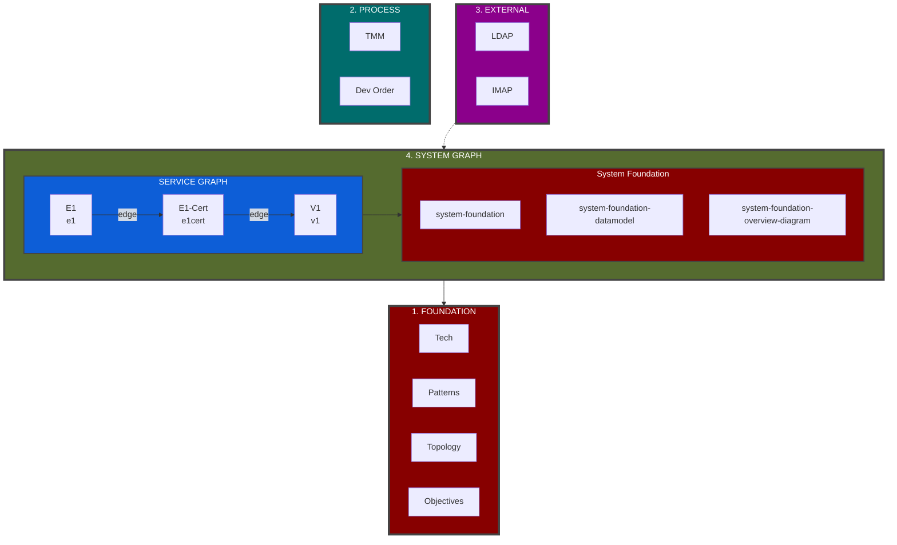
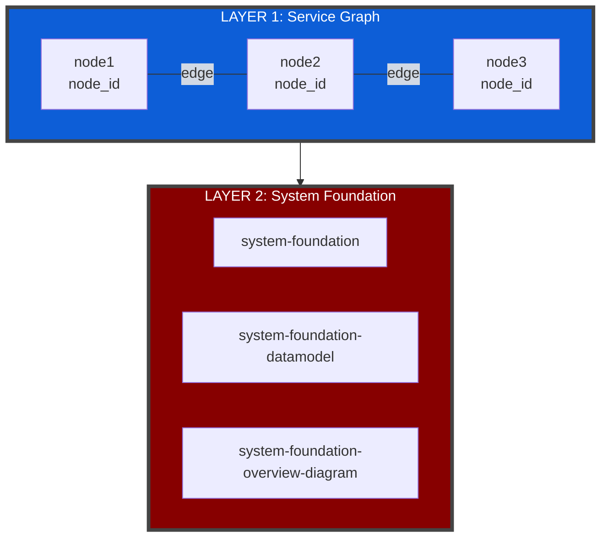
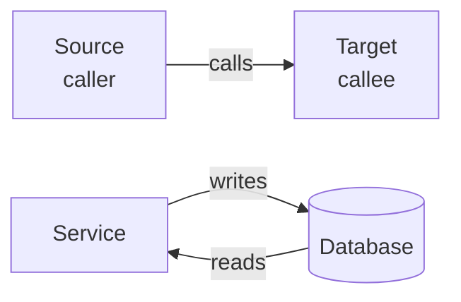

# TMM Foundation - Terminology, Objectives, Enforcement

**Version**: 0.9
**Purpose**: Foundational concepts for TMM (read during Stage 0 or when needed)
**Related**: [tmm-1-process_v1.0.md](tmm-1-process_v1.0.md), [tmm-2-templates_v0.9.md](tmm-2-templates_v0.9.md)

---

## Changelog v0.9

**v0.9** (2026-03-06):

- **Credo Documents**: Added §5 subsection explaining what credos are, when they're needed (SHOULD when ontological
  ambiguity exists, MAY otherwise), dual altitude concept, AV-R as compass, anchor graduation flow
- Examples from live project (agency-model, eidos-node-identity, gsd-visualization)
- Updated related link: tmm-1-process v0.7 → v1.0
- **Prefix change**: Replaced `context-` with `reference-` in §5 naming convention — `context-` is redundant
  with Foundation box (which IS context), `reference-` has distinct force: independent look-up knowledge

**v0.8** (2026-02-22):

- **Document Naming Convention**: Added combinatorial naming system to §5 (4BM)
- Three combinatorial prefixes (`adr-`, `focus-`, `context-`) + one standalone (`credo-`)
- Sub-domain support: `{domain}[-{subdomain}]*` (e.g., `python-async`, `delta-history`)
- Service-graph exception documented (no prefixes)
- Updated related link: tmm-1-process v0.6 → v0.7

**v0.7** (2026-01-23):

- **4BM Standard**: Aligned with Four Box Model naming convention v1.0
- **Box rename**: "Design Graph" → "System Graph"
- **Folder rename**: `design-graph/` → `service-graph/`
- **Terminology**: Added node_id vs node_name, Service definition, 4BM abbreviation
- **Diagrams**: Updated ASCII and Mermaid to show System Graph hierarchy
- **Arrow standard**: Source → Target in flowcharts

---

## 1. Why TMM

TMM exists because of **MVA (Most Viable Architecture)** principles:

> "Absorb complexity when it's cheap, transform it into lasting flexibility."
> — [MVA Elevator Pitch](../mva-elevator-pitch_v2.1.md)

**Key MVA Laws:**

1. **Tesler's Law**: Complexity moves, doesn't disappear
2. **Architectural Calcification**: Early decisions become irreversible
3. **Load-Bearing vs Decorative**: Not all decisions are equal

**TMM is the METHOD to apply MVA:**



**Critical Mission**: AI drags out ALL information from human's head and documents it in a human-AI supportive
structure (Four Boxes / 4BM).

---

## 2. Terminology

### Core Terms

| Term          | Definition                                                  | Example              |
|---------------|-------------------------------------------------------------|----------------------|
| **4BM**       | Four Box Model - the document structure                     | "See 4BM for naming" |
| **Service**   | Bounded code execution unit (microservice, module, package) | E1-Receive, V1       |
| **node_name** | Human-readable service name (text, speech)                  | `E1-Receive`         |
| **node_id**   | Lowercase, no-hyphen identifier (files, code)               | `e1receive`          |

**node_id derivation**: Remove hyphens, lowercase

- `E1-Receive` → `e1receive`
- `E1-Cert` → `e1cert`

### Document Layers

TMM documents capture three layers:

| Layer           | Contains        | Question Answered                          | Document Location             |
|-----------------|-----------------|--------------------------------------------|-------------------------------|
| **CONTEXT**     | WHY + WHERE     | Why does this exist? What's the domain?    | Foundation, Focus docs        |
| **CONSTRAINTS** | WHAT + WHAT-NOT | What are the boundaries? What's forbidden? | hard-rules, linked from nodes |
| **BEHAVIOR**    | HOW + HOW-NOT   | What should happen? What must not happen?  | Node/Edge docs                |

### Mapping to RFC-style

| TMM Term           | RFC Keywords       | Enforcement                    |
|--------------------|--------------------|--------------------------------|
| CONTEXT            | -                  | Understanding, not enforcement |
| CONSTRAINTS (Hard) | MUST, MUST NOT     | Violation = failure            |
| CONSTRAINTS (Soft) | SHOULD, SHOULD NOT | Violation = suboptimal         |
| BEHAVIOR           | MAY                | Guidance, AI chooses           |

---

## 3. System Objectives

Add to `system-foundation.md` during Stage 0:

### P0 - Non-Negotiable (Hard Constraints)

1. **Correctness** - Does it work as specified?
2. **Security** - Is it safe from threats?

### P1 - Primary (Optimize For)

3. **Reliability** - Does it keep working?
4. **Maintainability** - Can it be changed?
5. **Testability** - Can it be verified?

### P2 - Secondary (Nice to Have)

6. **Performance** - Is it fast enough?
7. **Simplicity** - Is it understandable?
8. **Evolvability** - Can it grow?

### Conflict Resolution Rules

- P0 always beats P1/P2
- Within same priority: context decides (document in ADR)
- When in doubt: prefer maintainability over performance
- When in doubt: prefer simplicity over features

---

## 4. Enforcement Levels

Design decisions flow from suggestion to hard rule:

```
Lowest                                         Highest
   │                                              │
   ▼                                              ▼
{entity}-design.md  →  ADR  →  hard-rules.md

 "how we do it"      "decided"   "must follow"
 "suggestion"        "why"       "never violate"
```

### ADR Standard

We use **Michael Nygard's ADR format**:

```markdown
# ADR-NNN: {Title}

## Status

{Proposed | Accepted | Deprecated | Superseded by ADR-XXX}

## Context

{What forces are at play? What's the situation?}

## Decision

{What we decided and why}

## Consequences

{What becomes easier? What becomes harder? Trade-offs?}
```

Reference: [Documenting Architecture Decisions](https://cognitect.com/blog/2011/11/15/documenting-architecture-decisions)

### ADR vs hard-rules

| Aspect              | ADR                                              | hard-rules              |
|---------------------|--------------------------------------------------|-------------------------|
| **Purpose**         | Document decisions with context                  | Enforce boundaries      |
| **Content**         | Context + Alternatives + Decision + Consequences | MUST/MUST NOT only      |
| **Constraint type** | Soft + Hard (mixed)                              | Hard only               |
| **Context use**     | High (needs WHY)                                 | Low (just the rule)     |
| **Loading**         | When exploring decision                          | Via `/nudge` (always)   |
| **Layering**        | Per decision                                     | Global → Project → Node |
| **Format**          | Prose, rationale                                 | Terse, AI-scannable     |

### Example: LDAP blocks event loop

| Level      | Where                         | Content                                                    |
|------------|-------------------------------|------------------------------------------------------------|
| Design     | `e1-cert-design.md`           | "LDAP package uses separate pool verticle"                 |
| ADR        | `adr-async-external-calls.md` | "Decision: All blocking external calls in pool verticles"  |
| Hard-rules | `vertx-hard-rules.md`         | "MUST NOT: Call blocking external service from event loop" |

---

## 5. The Four Box Model (4BM)

TMM targets a **finite** document structure. Every box MUST have content (n/a is valid filling).

**Boxes in workflow order:**

1. FOUNDATION (global patterns)
2. PROCESS (how we work)
3. EXTERNAL (what we depend on)
4. SYSTEM GRAPH (what we build)

### ASCII Layout

```
┌─────────────────┐ ┌─────────────────────────────────┐ ┌─────────────────┐
│  2. PROCESS     │ │        4. SYSTEM GRAPH          │ │  3. EXTERNAL    │
│                 │ │                                 │ │                 │
│ ┌─────────────┐ │ │ ┌─────────────────────────────┐ │ │ ┌─────────────┐ │
│ │    TMM      │ │ │ │      SERVICE GRAPH          │ │ │ │    LDAP     │ │
│ ├─────────────┤ │ │ │                             │ │ │ ├─────────────┤ │
│ │  dev-order  │ │ │ │  ┌────┐    ┌─────┐    ┌──┐  │ │ │ │   Dovecot   │ │
│ └─────────────┘ │ │ │  │ E1 │───▶│E1-C │───▶│V1│  │ │ │ │   (IMAP)    │ │
│                 │ │ │  └────┘    └─────┘    └──┘  │ │ │ └─────────────┘ │
│ DOCS:           │ │ │  e1       e1cert      v1    │ │ │                 │
│ tmm-*.md        │ │ └──────────────┬──────────────┘ │◀┼─────────────────│
│ dev-order.md    │ │ ┌──────────────▼──────────────┐ │ │ DOCS:           │
│                 │ │ │ system-foundation           │ │ │ external-*.md   │
│                 │ │ │ system-foundation-datamodel │ │ │                 │
│                 │ │ │ system-foundation-overview  │ │ │                 │
│                 │ │ └─────────────────────────────┘ │ │                 │
└─────────────────┘ └─────────────────────────────────┘ └─────────────────┘
                                    │
════════════════════════════════════╪════════════════════════════════════
                                    ▼
                ┌───────────────────────────────────────────────────────┐
                │                  1. FOUNDATION                        │
                │  ┌───────────┐ ┌──────────┐ ┌──────────┐ ┌──────────┐ │
                │  │Tech Stack │ │ Patterns │ │ Topology │ │Objectives│ │
                │  └───────────┘ └──────────┘ └──────────┘ └──────────┘ │
                │  DOC: ai/decided/foundation-*.md                      │
                └───────────────────────────────────────────────────────┘
```

### Mermaid (shows relationships)



### Document Locations

| Box                 | Documents                                                                     | Location                              |
|---------------------|-------------------------------------------------------------------------------|---------------------------------------|
| **1. Foundation**   | `foundation-*.md`, `adr-foundation-*.md`                                      | `ai/decided/`                         |
| **2. Process**      | `tmm-*.md`, `shaw-*.md`, `dev-order.md`                                       | `ai/prompts/TMM/`, `ai/prompts/shaw/`, `ai/project-docs/` |
| **3. External**     | `external-{name}.md`                                                          | `ai/project-docs/`                    |
| **4. System Graph** | `system-foundation*.md`, `service-graph/node-*.md`, `service-graph/edge-*.md` | `ai/project-docs/`                    |

### Document Naming Convention

All 4BM documents follow a combinatorial naming system:

```
[prefix?]-{box-base}-{domain}[-{subdomain}]*_v{X}.{Y}.md
```

Where:
- **prefix** ∈ {`adr`, `focus`, `reference`} or none — modifies a box-base pattern
- **box-base** ∈ {`foundation`, `process`, `external`, `system-foundation`}
- **domain** = free-form, hyphen-separated (`python`, `database`, `python-async`, `delta-history`...)
- **version** = `_v{major}.{minor}` suffix

**Base patterns by box:**

| Box | Base Pattern | Example |
|---|---|---|
| 1. Foundation | `foundation-{domain}.md` | `foundation-python_v3.2.md` |
| 2. Process | `process-{domain}.md` | `process-dev-order_v1.0.md` |
| 3. External | `external-{domain}.md` | `external-allabolag_v1.0.md` |
| 4.0 System Foundation | `system-foundation-{domain}.md` | `system-foundation-datamodel_v2.5.md` |
| 4.1 Service Graph | `node-{node_id}_v{X}.{Y}.md` | `node-e1cert_v1.0.md` |
| 4.1 Service Graph | `edge-{source}-{target}_v{X}.{Y}.md` | `edge-e1receive-e1cert_v1.0.md` |

**Prefix modifiers** (prepend to any box-base pattern EXCEPT service-graph docs):

| Prefix | Meaning | Example |
|---|---|---|
| `adr-` | Architecture Decision Record | `adr-foundation-python_v3.2.md` |
| `focus-` | Scoped/focused variant | `focus-external-allabolag_v1.0.md` |
| `reference-` | Independent look-up knowledge | `reference-terminology-physics-tips_v1.1.md` |

**Standalone prefix** (no box-base, no prescribed template — free-form philosophical documents):

| Prefix | Meaning | Example |
|---|---|---|
| `credo-` | Foundational belief/philosophy | `credo-agency-model_v1.3.md`, `credo-eidos-node-identity_v1.2.md` |

### Credo Documents

A **credo** is a load-bearing philosophical position that constrains downstream design. It appears when the project has
**ontological ambiguity** — when things shift shape depending on how you look at them, when you need to find Eidos.

**Credo is SHOULD when ontological ambiguity exists, MAY otherwise.** A script reading an API or an Ansible playbook
doesn't need credos. A system where "what IS an entity?" has multiple valid answers does.

**Dual altitude**: A credo operates at two levels simultaneously:

| Altitude | What it does | When you read it |
|----------|-------------|-----------------|
| **Position** (30,000 ft) | Constrains the solution space | TMM Stage 00, Intent anchoring |
| **Design instrument** (5,000 ft) | Generates concrete design questions | TMM Endgame, per-nodule design |

If a position doesn't generate design questions, it's decorative (just a belief statement). If it generates questions
but has no philosophical position, it's a checklist (tool, not credo).

**AV-R as compass**: The AV-R model (Agency-Vector-Reality) separates the two realms so designers know which part of the
problem they're in. Within AV, it further separates Agency (capacity) from Vector (action). This scoping makes
ontological ambiguity visible and navigable. Credos are positions taken within each realm — how much Agency do you
support? How much Vector? How do you handle R→R' drift?

Without AV-R the woods are one big wood. With AV-R you know whether you're discussing Reality (what IS) or
Agency-Vector (what we DO), and that scoping lets you take precise positions.

**Anchor graduation**: A credo starts as an anchor in FLIGHT-PLAN.md. When that anchor generates enough design questions
to fill a document, it *graduates* into a credo. The flow:

```
FLIGHT-PLAN.md (Root Intent + Anchors)
    | anchor graduates when it generates design questions
    v
Credo docs (project-docs/credo-*.md) — MAY/SHOULD
    | constrain
    v
system-foundation (Foundation Intent + architecture)
    | decompose into
    v
taxonomy, datamodel, overview-diagram
```

**Naming**: `credo-{topic}_v{X}.{Y}.md` — no box-base, no prescribed template. Free-form.

**Location**: `ai/project-docs/`

**Examples from a live project**:

| Credo | Position | Design questions it generates |
|-------|----------|-------------------------------|
| `credo-agency-model` | "Effectors channel Force as Focus" | How much casting? Focus measurement? |
| `credo-eidos-node-identity` | "One Eidos per node" | What IS this thing? Does it pass the Node Test? |
| `credo-gsd-visualization` | "Visualize the gap between R and Goal" | Focus duration or hours? Switching cost or utilization? |

**Sub-domain examples:**

- `foundation-python-async_v1.0.md` — Python async-specific foundation
- `adr-foundation-delta-history_v1.0.md` — ADR about delta/history decisions
- `adr-system-foundation-namespaces_v1.0.md` — ADR about namespace decisions

**Service-graph exception**: Node and edge docs never take prefixes. They follow their own pattern (see tmm-2-templates §2).

### Box Summary

| Box                 | Position | Purpose                 | MUST                                   | SHOULD                   |
|---------------------|----------|-------------------------|----------------------------------------|--------------------------|
| **1. Foundation**   | Below    | What everything sits on | Tech stack, patterns, objectives       | Topology, conventions    |
| **2. Process**      | Left     | How we work             | TMM docs, dev-order                    | Session mgmt             |
| **3. External**     | Right    | What we depend on       | List externals                         | Smoke tests per external |
| **4. System Graph** | Center   | What we build           | Service Graph nodes, system-foundation | Edges, overview diagram  |

### System Graph Layers

The System Graph has two layers:



| Layer                 | Contains                                   | Location                         |
|-----------------------|--------------------------------------------|----------------------------------|
| **Service Graph**     | Service nodes and edges                    | `ai/project-docs/service-graph/` |
| **System Foundation** | Tech, datamodel, overview for THIS project | `ai/project-docs/`               |

### Standard System Documents

| Document                                         | Purpose                                                        |
|--------------------------------------------------|----------------------------------------------------------------|
| `system-foundation_v{X}.{Y}.md`                  | Tech stack, patterns, objectives for THIS project              |
| `system-foundation-datamodel_v{X}.{Y}.md`        | ERD, schemas, data model                                       |
| `system-foundation-overview-diagram_v{X}.{Y}.md` | Top-level overview: service communication, DB read/write flows |

---

## 6. Diagram Standards

### Arrow Direction in Flowcharts

**Standard**: Source → Target (caller → callee)



- **API calls**: Caller → Callee
- **DB writes**: Service → Database
- **DB reads**: Database → Service (data flows TO reader)

### Diagram Reference

See [tmm-3-diagrams-examples_v0.3.md](tmm-3-diagrams-examples_v0.3.md) for:

- Color palette
- ERD, Flowchart, State, Sequence, Graph, Class, Gantt examples
- When to use each diagram type

---

## 7. Filling Rules

| Rule                  | Description                                        |
|-----------------------|----------------------------------------------------|
| **MUST fill**         | Every box MUST have content                        |
| **n/a is valid**      | "No external dependencies" is valid filling        |
| **null is NOT valid** | Empty section = incomplete (run /nag)              |
| **SHOULD detail**     | Fill sub-sections with as much detail as available |
| **Defer unknown**     | Mark unknown as "TBD" with bead reference          |
