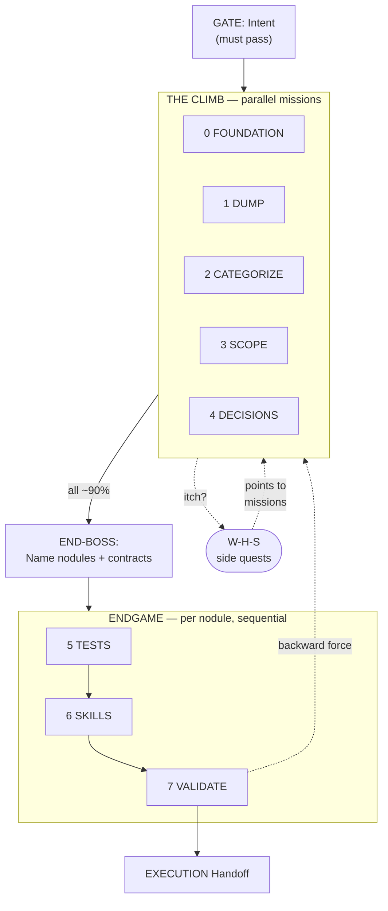

# TMM Process - The Game

**Version**: 1.0.1
**Purpose**: TMM process definition — the Game Model for META-level work
**Related**:

- [tmm-0-foundation_v0.8.md](tmm-0-foundation_v0.8.md) - Terminology, objectives, enforcement
- [tmm-2-templates_v0.9.md](tmm-2-templates_v0.9.md) - Document templates with extraction prompts
- [tmm-3-diagrams-examples_v0.3.md](tmm-3-diagrams-examples_v0.3.md) - Examples of excellent Mermaid diagrams
- `ai/prompts/shaw/shaw-research_v2.0.md` - W-H-S inner loop (find, test, lock)
- `ai/decided/upstream-downstream-flow_v1.2.md` - How FLIGHT-PLAN, MVA, W-H-S, TMM, and Coding relate

---

## 1. Overview

TMM is the process used during META level to help Human create system specifications that enable autonomous AI
execution.

**TMM Intent**: Help Human create META documents — aligned to Root/Foundation Intent — so AI can build with minimal
Human-in-the-Loop. The documents are the artifact. The Human-AI interaction is the engine.

```
META-META: Design TMM (this document)
    ↓
META: USE TMM — the Game — to pen rims and define nodules (toward Intent)
    ↓
EXECUTION: AI implements per nodule from specs
```

**For WHY TMM exists, see**: [tmm-0-foundation_v0.8.md](tmm-0-foundation_v0.8.md) (MVA philosophy, terminology)

**For document templates, see**: [tmm-2-templates_v0.9.md](tmm-2-templates_v0.9.md) (templates with extraction prompts)

---

## 2. The Game

```
GATE:       Intent (must pass — blocker)
                ↓
CLIMB:      Five parallel missions — pen rims, earn ~90% in each
                ↓ (all missions ~90%)
END-BOSS:   Name every nodule and its contracts
                ↓ (defeat end-boss)
ENDGAME:    Per nodule: Tests → Skills → Validate → Build
                ↓
GRAIL:      System docs ready. AI builds. HitL minimized.
```



### What Changed from v0.7

| v0.7                               | v1.0                                                       |
|------------------------------------|------------------------------------------------------------|
| "Current Stage: 0"                 | Scorecard — five mission scores                            |
| Stages 0-4 sequential              | Missions 0-4 parallel                                      |
| "Stuck in stage 0 for 39 sessions" | "Climbing — earning points across missions simultaneously" |
| W-H-S = inner loop                 | W-H-S = side quests earning points in multiple missions    |
| 4BM = document containers          | 4BM = rim structure (1-3 outer, 4.0 inner, 4.1 gravity)    |
| One endgame pass                   | Endgame per nodule with code↔tests feedback                |
| DUMP = stage 1                     | DUMP = continuous (Latent rims → Penned)                   |
| CATEGORIZE = stage 2               | CATEGORIZE = continuous (placement accuracy)               |

---

## 3. The Gate: Intent

**Intent is a blocker, not a mission.** Must have a good-enough version before any mission begins.

### Intent Chain

```
Root Intent (FLIGHT-PLAN.md §Root Intent)
  └─ Foundation Intent (system-foundation doc §1)
       └─ Nodule Intent (service-graph/node-{nodule}_v{X}.{Y}.md §Intent)
            └─ W-H-S Intent (per walk session)
                 └─ carries backward force upward when violated
```

Each level narrows from the level above. Remove a level → everything below loses its gauge.

| Level             | Location                          | What it answers                                            |
|-------------------|-----------------------------------|------------------------------------------------------------|
| Root Intent       | `FLIGHT-PLAN.md`                  | Why does this product exist?                               |
| Foundation Intent | `system-foundation*.md` §1        | What architectural choices make the Root Intent buildable? |
| Nodule Intent     | `service-graph/node-{nodule}*.md` | What does this nodule do within the Foundation?            |
| W-H-S Intent      | W-H-S doc header                  | What itch are we scratching right now?                     |

### AI Behavior

1. Read Root Intent from `FLIGHT-PLAN.md`
2. Read Foundation Intent from `system-foundation*.md` §1
3. The Gate passes when Foundation Intent exists and is acknowledged by Human
4. Foundation Intent persists above all missions. It is not "completed." Every mission reads it.

**Entry criteria**: Root Intent exists in `FLIGHT-PLAN.md`
**Exit criteria**: Foundation Intent written in system-foundation §1 and acknowledged by Human

---

## 4. The Climb: Five Parallel Missions

The Climb is the rim-penning process. Each mission corresponds to a constraint dimension. As rims are anchored,
gravity increases inside, and the architecture converges toward its natural shape.

### 4BM as Rim Structure

```
┌──────────────────────────────────────────────┐
│  Box 1: FOUNDATION (global)    ← OUTER RIM   │
│  Box 2: PROCESS (global)       ← OUTER RIM   │
│  Box 3: EXTERNAL (global)      ← OUTER RIM   │
│                                              │
│  ┌───────────────────────────────────────┐   │
│  │  Box 4.0: Service Foundation          │   │
│  │   (system-foundation)    ← INNER RIM  │   │
│  │  ┌───────────────────────────────┐    │   │
│  │  │  Box 4.1: Service Graph       │    │   │
│  │  │    (nodule specs)  ← GRAVITY  │    │   │
│  │  └───────────────────────────────┘    │   │
│  └───────────────────────────────────────┘   │
└──────────────────────────────────────────────┘
```

### Scorecard

The progress doc shows a scorecard, not a stage pointer:

```
SCORECARD — {Epic Name}
Intent: {statement} ← GATE PASSED

  0 FOUNDATION    [████████░░] 82%    Rims anchored, hard rules in place
  1 DUMP          [██████░░░░] 65%    Latent rims still surfacing
  2 CATEGORIZE    [████████░░] 78%    Few misplacements remaining
  3 SCOPE         [███████░░░] 72%    Nodule boundaries forming
  4 DECISIONS     [████████░░] 85%    Most ADRs decided

  W-H-S side quests active: 1 (blocking), 2 (enriching)

  → Not ready for End-Boss (DUMP < 90%)
```

### Mission 0: FOUNDATION

**Rim**: Pen the outer constraints (Boxes 1-3). Tech stack, patterns, hard rules, external dependencies.

**How to score**: Anchor confidence on Foundation Intent anchors. Each anchored constraint = one point of gravity.

**AI Behavior**:

- Check if foundation documents exist
- If not, ask foundation questions (tech stack, patterns, topology)
- Use template from [tmm-2-templates_v0.9.md](tmm-2-templates_v0.9.md)
- Pen each discovered rim (Five Rims in system-foundation)
- W-H-S side quests earn FOUNDATION points when they discover constraints

**Outputs**: `system-foundation*.md`, `adr-foundation-*.md`, `credo-*.md`

### Mission 1: DUMP

**Rim**: Discover Latent rims in the human's head. What does the human know but hasn't said?

**How to score**: Track how often W-H-S sessions discover things the human already knew but hadn't dumped. When
unknown-knowns approach zero → DUMP is at ~90%.

**AI Behavior**:

- Ask open-ended questions continuously (not just in one phase)
- Probe for: edge cases, failures, dependencies, external services
- Use "How to Ask" prompts from templates
- Use `/nag` to find unknown-unknowns
- **Key questions**:
   - "What else is in your head that we haven't captured?"
   - "What do you know that you haven't told me yet?"
   - "What's obvious to you that might not be obvious to AI?"

**This is continuous, not a phase.** Every session should include dump moments. MVA + W-H-S + /nag are the mechanisms.

### Mission 2: CATEGORIZE

**Rim**: Place things in the right box. Placement accuracy.

**How to score**: Track how often things end up in the wrong box. When misplacements approach zero → CATEGORIZE is at
~90%.

| Category            | Target Box                       |
|---------------------|----------------------------------|
| Tech/patterns       | Foundation (Box 1)               |
| Process/order       | Process (Box 2)                  |
| External dependency | External (Box 3)                 |
| This nodule         | System Graph — node (Box 4.1)    |
| Between nodules     | System Graph — edge (Box 4.1)    |
| Architecture        | System Foundation (Box 4.0)      |
| Decision needed     | ADR → Foundation or System Graph |

**This is continuous, not a phase.** Every W-H-S synthesis should categorize its results.

### Mission 3: SCOPE

**Rim**: Define boundaries. What's inside a nodule, what's an edge to another nodule, what's external?

**How to score**: How clear are the nodule boundaries? When a new concept arrives and you immediately know which nodule
it belongs to → SCOPE is at ~90%.

**Key Question**: "Is this inside our nodule, an edge to another nodule, or external?"

### Mission 4: DECISIONS

**Rim**: Document constraints. ADRs, hard rules, closed decisions.

**How to score**: How many open decisions remain? How confident are the decided ones? When new W-H-S walks rarely
produce decisions that contradict existing ones → DECISIONS is at ~90%.

**Enforcement Check** — does this decision belong in:

- Design doc (suggestion)
- ADR (decided)
- Hard-rules (must follow)

See [tmm-0-foundation_v0.8.md](tmm-0-foundation_v0.8.md) for ADR vs hard-rules distinction.

### W-H-S as Side Quests

At any point during the Climb, an **itch** triggers a W-H-S side quest. Side quests earn points in one or more
missions simultaneously:

```
W-H-S: "Storage/Flow Walk"
  → FOUNDATION points (tree-ancestry ownership)
  → SCOPE points (8 collections defined)
  → DECISIONS points (ws field killed, Penned/Latent decided)
```

W-H-S process details live in `ai/prompts/shaw/shaw-research_v2.0.md`.

**Three types of side quests**:

| Type          | Relationship to Climb                   | Example                                            |
|---------------|-----------------------------------------|----------------------------------------------------|
| **Blocking**  | Can't advance mission without resolving | "LOC is not a node" — blocked FOUNDATION           |
| **Enriching** | Makes missions stronger                 | "Eidos spectrum" — deepened FOUNDATION + DECISIONS |
| **Optional**  | Parked, may never use                   | "Voice control research" — parked                  |

### Rims: Latent vs Penned

A rim can be **Latent** (structurally obeyed but unnamed) or **Penned** (explicitly anchored and documented). The
Climb includes discovering Latent rims and Penning them.

Every time a W-H-S discovers "oh, THAT'S a constraint we've been obeying without naming" — that's a Latent rim
becoming Penned. Each newly Penned rim adds a dimension to the gravity field.

---

## 5. The End-Boss

**Gate condition**: All five missions at ~90%.

**The test**: Can you name every nodule and its contracts?

If gravity is strong enough (rims well-anchored), the nodules name themselves — they emerge naturally from the
constraint intersections. If you struggle to name them, you haven't anchored enough rims.

**End-boss deliverable**: Service-graph manifest — a graph of nodules with their contracts (edges between nodules).

**AI Behavior at End-Boss**:

1. Present the scorecard — confirm all missions at ~90%
2. List discovered nodules with confidence
3. For each nodule: name, responsibility, contracts (edges to other nodules)
4. Ask Human: "Does this graph feel right? Any missing nodules?"
5. If nodules are unclear → fall back to Climb (score was premature)

---

## 6. The Endgame: Per Nodule

The Endgame runs **per nodule**, not system-wide. Multiple nodules can be at different endgame stages. There is a
code↔tests feedback loop — you build, test, discover something, rebuild.

### Stage 5: TESTS (per nodule)

**Box Target**: System Graph (test cases), External (smoke tests)

- Every functionality → test case
- Every failure mode → test case
- Every external dependency → smoke test

### Stage 6: SKILLS (per nodule)

**Box Target**: Process (dev-order), System Graph (features)

**Output**: `dev-order.md` showing nodule and package dependencies.

### Stage 7: VALIDATE + EXECUTION Handoff (per nodule)

**Validation**:

1. **Intent alignment** — Re-read Root Intent and Foundation Intent. Does this nodule serve the Intent? If drift
   detected → backward force to Climb.
2. **Completeness** — Use checklist from [tmm-2-templates_v0.9.md](tmm-2-templates_v0.9.md)
3. **Contract check** — Are all edges to other nodules defined?

**EXECUTION Handoff Message** (AI says this after Stage 7 passes for a nodule):

> "Nodule {name} spec is complete. Four Boxes filled for this nodule.
>
> **Next step**: Start EXECUTION with this nodule and return with 'how did it go'.
>
> The TMM Epic stays open. Only you (human) can close it after EXECUTION feedback.
>
> Recommended first nodule: {lowest dependency from dev-order.md}"

### Endgame Feedback Loop

```
Per nodule:
    Tests → Skills → Validate → Build
        ↑                         │
        └── code↔tests feedback ──┘
             (discover → fix → retest)
```

If VALIDATE reveals a rim problem → backward force to Climb. This is G8: discovering from inside gravity that a rim
needs re-anchoring.

---

## 7. Feedback Loops

TMM has three feedback loops: Inner (session), Outer (post-EXECUTION), and Backward (W-H-S/Endgame → Climb).

### 7.1 Inner Loop (Session End)

At end of each TMM session, ask:

| Question                          | Purpose                                  |
|-----------------------------------|------------------------------------------|
| What did AI learn today?          | Document new context for future sessions |
| What did Human learn?             | Surface implicit knowledge made explicit |
| How can we improve for next time? | Process improvement                      |
| Which missions gained points?     | Update scorecard                         |

### 7.2 Outer Loop (Post-EXECUTION)

After EXECUTION of a nodule, human returns with feedback:

```markdown
## Post-EXECUTION Review — {nodule_name}

### Spec Quality

- [ ] AI executed without blocking questions
- [ ] No hard constraints violated
- [ ] Trade-offs matched predictions

### Gaps Discovered

| Gap                | Impact                      | Which rim? |
|--------------------|-----------------------------|------------|
| {what was missing} | {how it affected EXECUTION} | {rim name} |

### Process Improvement

- What would we add to TMM for next nodule?
- What questions should AI have asked during the Climb?
```

**Key metric**: "How many times did AI stop and ask Human during EXECUTION?"

- Zero = perfect spec (all rims well-anchored)
- Each question = a rim gap

### 7.3 Backward Force (W-H-S/Endgame → Climb)

When a W-H-S Synthesis or Endgame VALIDATE produces a result that contradicts a rim, backward force occurs.

**Manual check after each W-H-S Synthesis**:

1. **What changed?** Name the eigenstate (the locked result)
2. **How deep?** Assess MVA depth:
   - **Shallow** (property name, formatting) → note it, move on
   - **Medium** (scope boundary, edge direction) → check affected missions
   - **Deep** (Eidos boundary, structural assumption) → mandatory upstream check
3. **Which missions?** List missions affected
4. **Which rims?** List rim documents that need re-anchoring

**Proportionality rule**: Upstream check is proportional to MVA depth. Don't force a full review for a property rename.
Do force it when an Eidos boundary moves.

---

## 8. Multi-Session Support

TMM for a complex system may span weeks across multiple sessions.

### 8.1 Session Boundaries

Natural session boundaries in the Game Model:

| Transition                 | Session Boundary? | Reason                                    |
|----------------------------|-------------------|-------------------------------------------|
| Gate passed → Climb begins | YES               | Intent locked, missions start             |
| Mid-Climb                  | ANY               | Pause anywhere, scorecard preserves state |
| Climb → End-Boss           | YES               | All missions ~90%, major gate             |
| End-Boss → Endgame         | YES               | Nodules named, endgame begins             |
| Between nodule endgames    | YES               | One nodule complete, next begins          |

### 8.2 Pause/Resume

When pausing, update the scorecard in the progress doc:

```markdown
## TMM Status — {epic_name}

### Scorecard

0 FOUNDATION    [████████░░] 82%
1 DUMP          [██████░░░░] 65%
2 CATEGORIZE    [████████░░] 78%
3 SCOPE         [███████░░░] 72%
4 DECISIONS     [████████░░] 85%

### Active Side Quests

- {W-H-S topic} — {blocking/enriching/optional}

### Next Action

{what to do when resuming}

### Endgame Progress (if applicable)

| Nodule | Tests | Skills | Validate | Build  |
|--------|-------|--------|----------|--------|
| {name} | ✅     | ✅    | 🔄       | ⏳     |
```

### 8.3 W-H-S vs TMM Sessions

TMM and W-H-S have separate save/resume mechanisms — different loop levels:

| Concern        | TMM (the Game)                    | W-H-S (side quest)                  |
|----------------|-----------------------------------|-------------------------------------|
| Save command   | `/pause-tmm`                      | `save-whs`                          |
| Resume command | `/resume-tmm`                     | `continue-whs`                      |
| What's saved   | Scorecard, active quests, nodules | Anchors, itch direction, injections |
| Session shape  | Missions → scorecard → nodules    | Walk → Hammer → Synthesis           |
| Time horizon   | Days to weeks                     | Hours to days                       |

**Rule**: If you're mid-W-H-S inside TMM, save BOTH:

1. `/save-whs` — captures the walk state
2. `/pause-tmm` — captures the scorecard and game state

### 8.4 Session Commands

| Command       | When          | Action                                                |
|---------------|---------------|-------------------------------------------------------|
| `/resume-tmm` | Session start | Load scorecard, check Intent, show active side quests |
| `/pause-tmm`  | Session end   | Update scorecard, log session, chain to `/txo-land`   |

---

## 9. Quick Reference

### TMM Start (New Epic)

1. Pass the Gate (Intent) — narrow from Root Intent
2. Check Foundation — does it exist? How complete?
3. Begin the Climb — work all five missions in parallel
4. Use W-H-S side quests to earn points
5. When all missions ~90% → face the End-Boss
6. Name nodules → enter Endgame per nodule
7. Tests → Skills → Validate → EXECUTION Handoff

### Scorecard Signals

| Score  | Signal          | Action                  |
|--------|-----------------|-------------------------|
| < 50%  | Just started    | Walk more than hammer   |
| 50-79% | Making progress | Mix of walk and hammer  |
| 80-89% | Nearly there    | Hammer more than walk   |
| ≥ 90%  | Holds           | Ready for End-Boss gate |

### Document Locations

```
ai/decided/                       # Box 1: Foundation (outer rim)
  foundation-*.md
  adr-foundation-*.md

ai/prompts/TMM/                   # Box 2: Process (outer rim)
  tmm-*.md

ai/project-docs/                  # Boxes 3-4
  external-{name}.md              # Box 3: External (outer rim)
  system-foundation*.md           # Box 4.0: Inner rim
  service-graph/                  # Box 4.1: Gravity (nodules)
    service-graph-index.md
    node-{nodule_id}_v{X}.{Y}.md
    edge-{source}-{target}_v{X}.{Y}.md
```

### TMM Epic Lifecycle

```
TMM Epic opened (Human)
├── GATE: Intent declared and passed
├── CLIMB: Five parallel missions
│   ├── W-H-S side quests at any point
│   │   └── Backward force may lower mission scores
│   └── Scorecard updated each session
├── END-BOSS: Nodules named, contracts defined
├── ENDGAME: Per nodule
│   ├── Tests → Skills → Validate → Build
│   └── Backward force may return to Climb
├── EXECUTION handoff (per nodule)
├── Human goes to EXECUTION
│   └── (TMM Epic stays open)
├── Human returns with "how did it go" (per nodule)
├── Outer loop feedback captured
└── TMM Epic closed (Human only, after all nodules)
```

---

## 10. Version History

| Version | Date       | Changes                                                                                                     |
|---------|------------|-------------------------------------------------------------------------------------------------------------|
| 1.0     | 2026-02-24 | **Game Model**: Complete rewrite. Parallel missions, scorecard, nodules, rims, end-boss, endgame per nodule |
| 0.7     | 2026-02-19 | Intent + W-H-S: Stage 00, W-H-S inner loop, backward force, TMM/W-H-S save distinction                      |
| 0.6     | 2026-01-23 | 4BM Standard: Design Graph → System Graph, updated locations                                                |
| 0.5     | 2026-01-04 | Split into 3 docs. Feedback loops, EXECUTION handoff, terminology, objectives                               |
| 0.4     | 2026-01-03 | Four Boxes Model                                                                                            |
| 0.3     | 2026-01-01 | Stage 0 FOUNDATION                                                                                          |
| 0.2     | 2026-01-01 | Research loops, session logging                                                                             |
| 0.1     | 2025-12-31 | Initial draft from META-META discussion                                                                     |

---

## Changelog v1.0

**v1.0** (2026-02-24):

- **Game Model**: Complete rewrite from v0.7. Stages 0-4 become parallel missions with scores. Stages 5-7 become
  sequential endgame per nodule. W-H-S = side quests earning points across missions.
- **Intent is a Gate**: Not a mission. Must pass before anything.
- **Scorecard replaces stage pointer**: Progress doc shows mission scores, not "Current Stage: N".
- **4BM = Rim Structure**: Boxes 1-3 = outer rims. Box 4.0 = inner rim. Box 4.1 = gravity where nodules live.
- **Nodule**: Service-graph unit for monolith. Emerges from gravity when rims are sufficiently anchored.
- **Latent→Penned rims**: DUMP is continuous (discovering what human knows but hasn't said). CATEGORIZE is continuous
  (placement accuracy).
- **End-boss**: Can you name every nodule and its contracts? If gravity is strong enough, nodules name themselves.
- **Provenance**: FLIGHT-PLAN W-H-S sessions 7-8, TMM Game Model anchors G1-G10.
