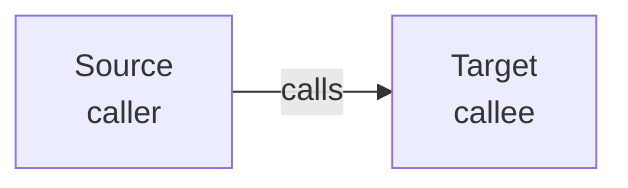
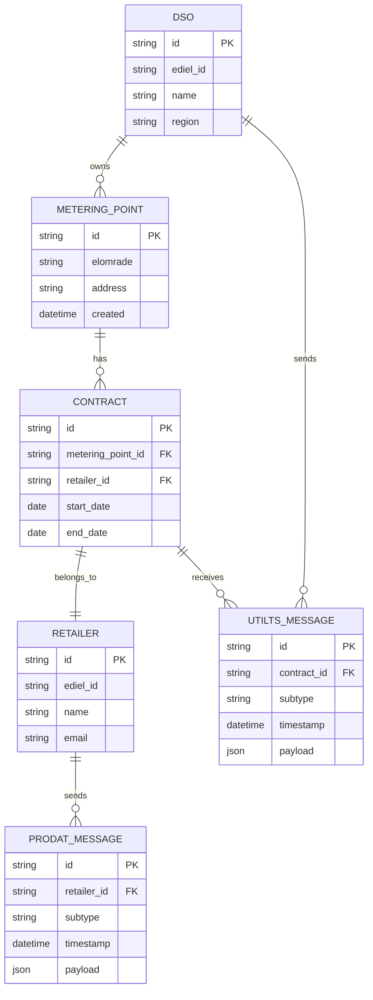
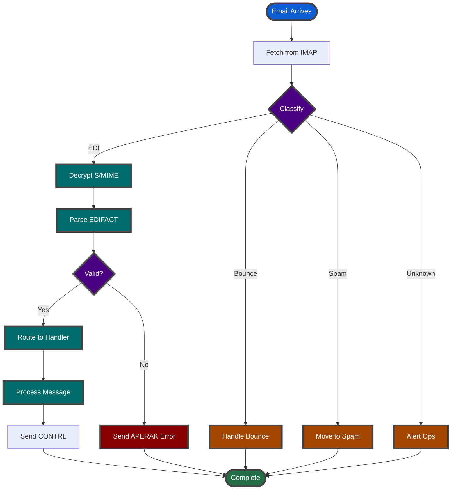
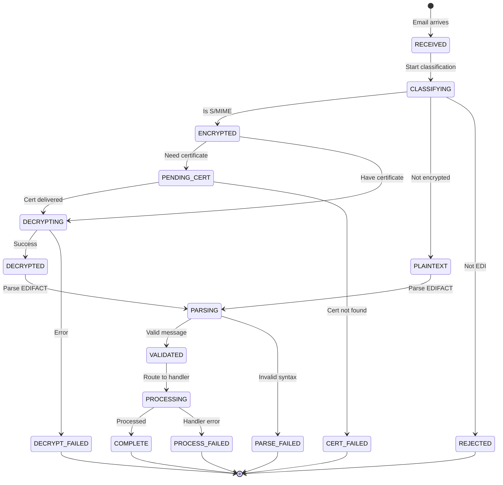
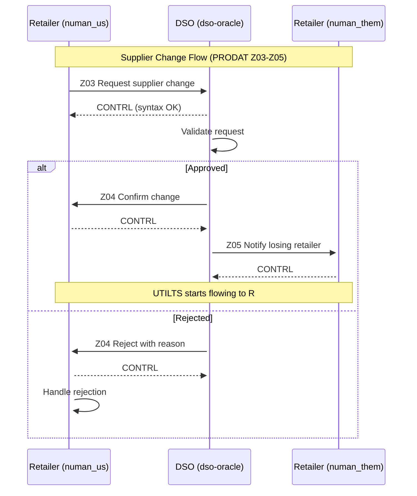
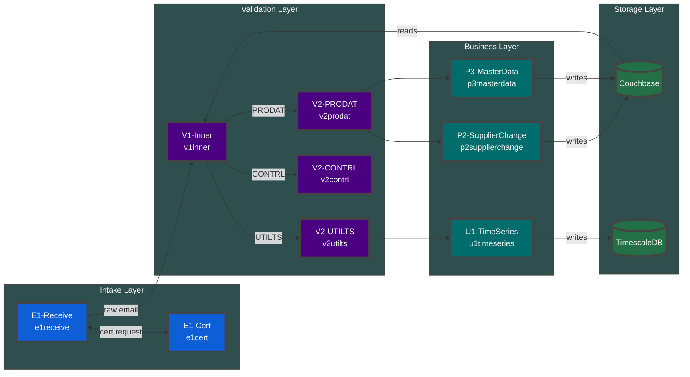
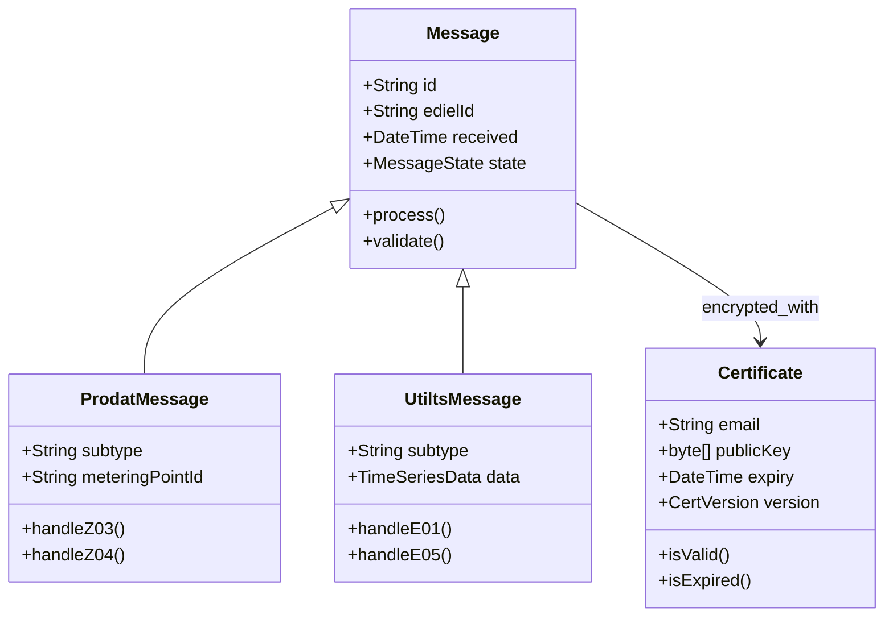
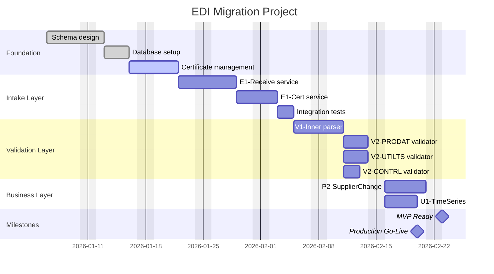

# TMM Diagrams Examples

**Version**: 0.3
**Purpose**: Mermaid diagram examples for TMM documentation
**Related**:

- [tmm-0-foundation_v0.8.md](tmm-0-foundation_v0.8.md)
- [tmm-2-templates_v0.9.md](tmm-2-templates_v0.9.md)
- [mermaid-colors.md](../mermaid-colors.md)

---

## Changelog v0.3

**v0.3** (2026-01-23):

- **Arrow direction standard**: Source → Target (caller → callee) documented
- **DB read/write convention**: Service → DB for writes, DB → Service for reads
- **4BM alignment**: Updated terminology

---

## Arrow Direction Standard

**CRITICAL**: All flowcharts MUST follow Source → Target convention.

| Interaction | Arrow Direction    | Example           |
|-------------|--------------------|-------------------|
| API call    | Caller → Callee    | `E1 --> V1`       |
| Event send  | Sender → Receiver  | `E1 --> EventBus` |
| DB write    | Service → Database | `P2 --> CB`       |
| DB read     | Database → Service | `CB --> V1`       |

**Rationale**: Arrow shows flow of control (calls) or flow of data (reads/writes).

---

## Color Palette

| Color    | Hex     | Use For                         |
|----------|---------|---------------------------------|
| Blue     | #0D5ED7 | Service nodes, primary entities |
| Green    | #237046 | Data, success states            |
| Dark Red | #870000 | Foundation, schemas, critical   |
| Indigo   | #4B0082 | Edges, contracts, decisions     |
| Orange   | #A34700 | Data Model, warnings            |
| Slate    | #2F4F4F | Containers, grouping            |
| Teal     | #006C6C | Process, workflow               |
| Olive    | #556B2F | System Graph container          |
| Magenta  | #8B008B | External services               |
| Gray     | #696969 | Background, neutral             |

---

## 1. ERD (Entity Relationship Diagram)

Use for: Data model, database schema, document relationships

---

## 2. Flowchart

Use for: Process flows, decision trees, workflows

**Note**: Arrow direction = Source → Target (caller → callee)

---

## 3. State Diagram

Use for: Entity lifecycle, message states, workflow states

---

## 4. Sequence Diagram

Use for: Service interactions, message flows, API calls

---

## 5. Graph (Nodes and Edges)

Use for: System architecture, service dependencies, Service Graph

**Note**: Arrow direction = Source → Target (caller → callee)
**Note**: DB writes = Service → DB, DB reads = DB → Service

---

## 6. Class Diagram (Bonus)

Use for: Domain model, object relationships, interfaces

---

## 7. Gantt Chart

Use for: Project timelines, implementation phases, migration schedules

---

## Quick Reference

| Diagram Type | Mermaid Keyword            | Best For                 |
|--------------|----------------------------|--------------------------|
| ERD          | `erDiagram`                | Data model, schemas      |
| Flowchart    | `flowchart TB/LR`          | Process, decisions       |
| State        | `stateDiagram-v2`          | Lifecycle, states        |
| Sequence     | `sequenceDiagram`          | Interactions, APIs       |
| Graph        | `flowchart` with subgraphs | Architecture             |
| Class        | `classDiagram`             | Domain model             |
| Gantt        | `gantt`                    | Timelines, project plans |

---

## Omitted Diagram Types

Other Mermaid diagram types not included in this guide:

| Diagram      | Keyword         | Use Case                   | TMM Relevance                 |
|--------------|-----------------|----------------------------|-------------------------------|
| Pie          | `pie`           | Proportions, distributions | Low - rarely needed           |
| Timeline     | `timeline`      | Events over time           | Low - Gantt covers most cases |
| Quadrant     | `quadrantChart` | 2x2 matrices               | Low - better in tables        |
| Mindmap      | `mindmap`       | Brainstorming, concepts    | Low - exploration, not docs   |
| Git Graph    | `gitGraph`      | Branch visualization       | Low - niche use case          |
| C4           | `C4Context`     | Formal C4 architecture     | Low - flowchart suffices      |
| User Journey | `journey`       | UX flows                   | Low - backend focus           |
| Sankey       | `sankey-beta`   | Flow quantities            | Low - very specialized        |
| XY Chart     | `xychart-beta`  | Data visualization         | Low - use real charting tools |

---

## Version History

| Version | Date       | Changes                                                       |
|---------|------------|---------------------------------------------------------------|
| 0.3     | 2026-01-23 | Arrow direction standard, DB read/write convention, 4BM terms |
| 0.2     | 2026-01-15 | Add Gantt chart, Omitted diagram types table                  |
| 0.1     | 2026-01-05 | Initial examples for ERD, Flow, State, Sequence, Graph, Class |
