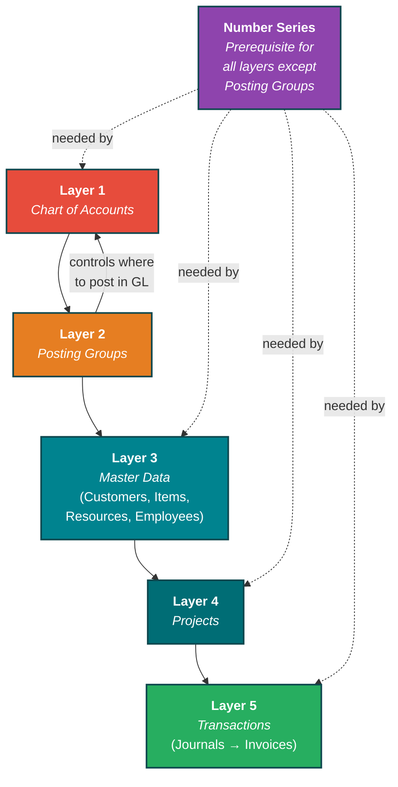
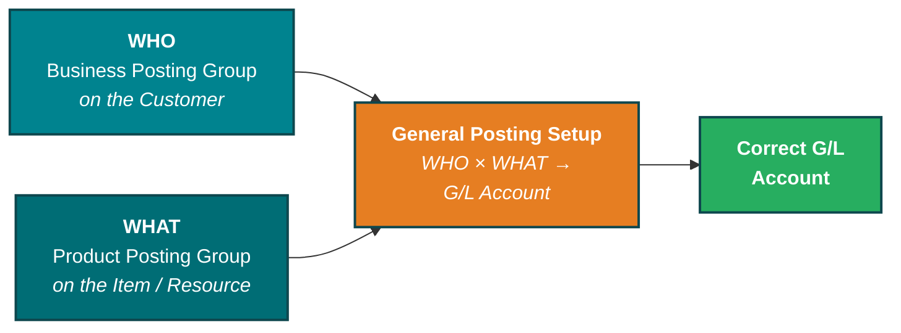
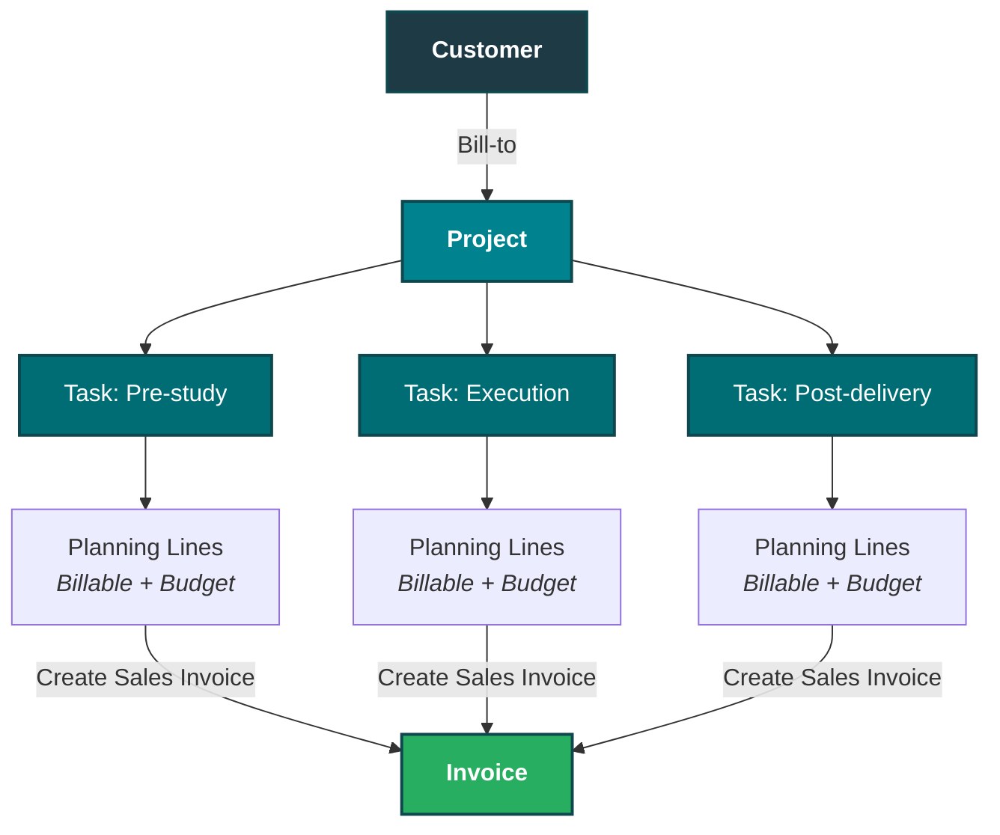
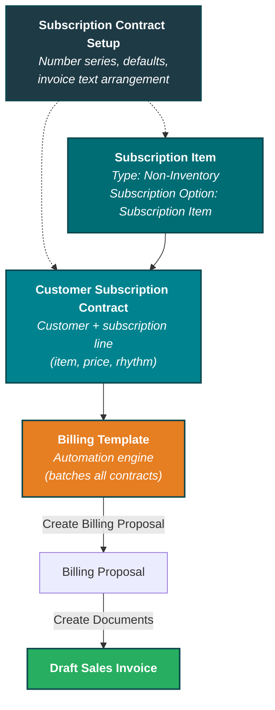
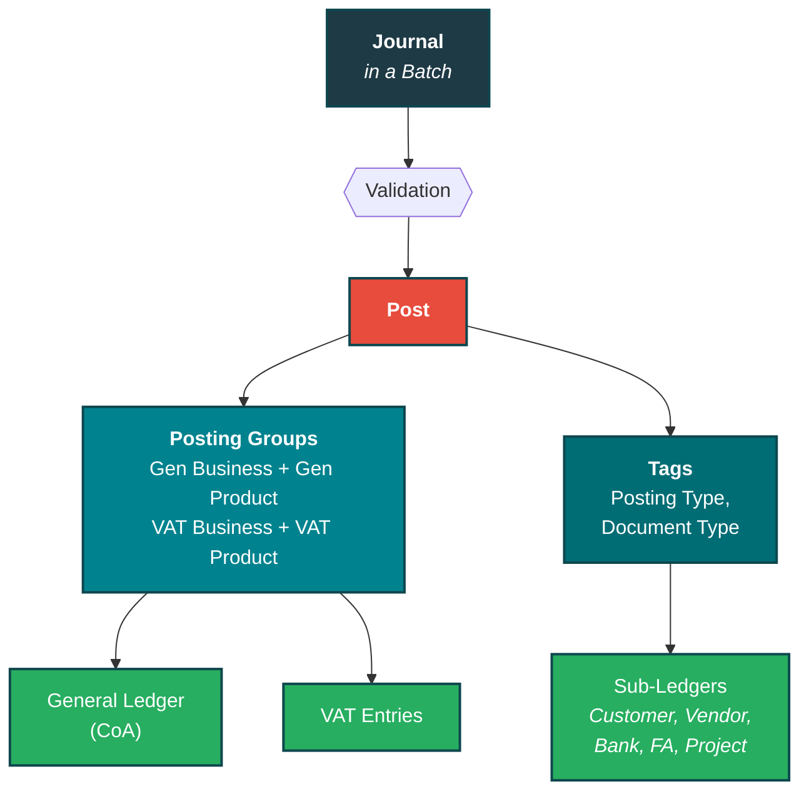
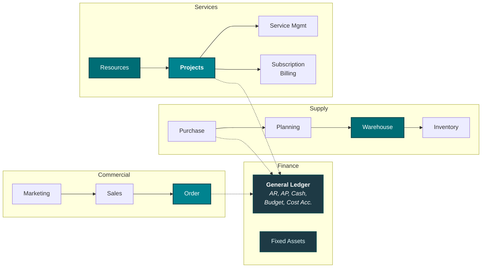

# Business Central — Best Practice Playbook

**Version**: 0.3 — Draft
**Status**: In progress
**Created**: 2026-06-04
**Updated**: 2026-06-12
**Author**: Tentixo AB
**Scope**: Recommended patterns for Business Central setup, posting architecture, and project management

> This document describes how Tentixo recommends Business Central be configured for Nordic
> service and consulting companies. It is opinionated by design — the patterns here reflect
> what we've seen work across implementations and what we've seen cause pain when skipped.

---

## 1. Why this matters

Most Business Central problems aren't bugs — they're setup decisions that seemed fine at the time but compound into reporting blind spots, manual workarounds, and audit exposure. The earlier you get the foundation right, the cheaper every change above it becomes.

This playbook covers the structural decisions that, in our experience, determine whether BC becomes a single source of truth or another system people work around.

---

## 2. The layered hierarchy — setup order matters

Every layer in BC depends on the one below it. Get a lower layer wrong and everything above inherits the error.



**Number Series** are a prerequisite for every layer that creates records — but not for Posting Groups (configuration, not records). If a number series isn't set up for a module, that module is blocked entirely. Number Series sits alongside the hierarchy, not linearly above it.

**Posting Groups → CoA**: The bidirectional arrow between Layer 1 and Layer 2 is intentional. Posting groups depend on the Chart of Accounts (they reference G/L accounts) and they *control* which accounts transactions land on. Getting either wrong breaks everything above.

**Implication**: Before creating customers, items, or projects, the chart of accounts and posting groups must be intentionally designed — not inherited from a demo company or a previous implementation.

---

## 3. Chart of accounts — design for cost structure

### 3.1 The intent of the chart of accounts

The chart of accounts is not a filing cabinet for transactions. Its purpose is to answer: **what does it cost us to deliver this type of revenue?**

A well-designed CoA separates revenue by the cost drivers behind it. We recommend organising the 3000-series (revenue) around three categories:

| Range | Category | Cost driver | Examples |
|-------|----------|-------------|----------|
| 30xx  | **Goods** | Physical — shipping, warehousing, customs | Hardware resale, physical products |
| 31xx  | **Virtual** | Low marginal — self-serve, electronic | Software licenses, SaaS, electronic services |
| 32xx  | **Human** | Employee-bound — HR, availability | Consulting, advisory, professional services |
| 34xx  | **WIP** | Activated cost (work in progress) | Project costs before final invoicing |

The 34xx range aggregates costs from Goods, Virtual, and Human during project execution. WIP accounts track *why* something was activated, not what was activated. When the final invoice is posted, costs move from WIP back to the granular revenue categories (30xx–32xx).

The same structure mirrors into the 4000-series (cost of goods sold): account 3011 (goods revenue) pairs with 4011 (purchase of goods).

### 3.2 The litmus test

> If we remove all humans from the delivery, can we still sell this?

If **no** → it belongs in the Human range (32xx), regardless of whether the pricing model is fixed, T&M, or subscription. A fixed-price consulting package is still human-bound.

If **yes** → it is either Goods (physical) or Virtual (electronic/self-serve).

### 3.3 The tree rule

The chart of accounts is a tree — each account has exactly one parent. If you use granular child accounts (e.g., 3211 for consulting type A, 3212 for type B), **do not also post to the parent account** (3210). They overlap. Pick one level and use it consistently.

Violating this rule makes it impossible to get accurate totals without manual checking.

### 3.4 VAT and electronic services

Within the Virtual category, VAT law distinguishes between **electronic services** (self-serve download, no human involvement) and regular services. This distinction affects cross-border VAT treatment, particularly within the EU.

The correct way to handle this is through the **VAT Product Posting Group**, not by creating separate items. One license item can be sold domestically and internationally — BC applies the correct VAT rate automatically through the posting group matrix.

---

## 4. Posting groups — the architecture that prevents item duplication

### 4.1 The WHO × WHAT matrix

This is the single most important architectural feature in Business Central — and the one most often underused.



- The **Business Posting Group** on the Customer answers: **who are we selling to?** (domestic, export, intercompany)
- The **Product Posting Group** on the Item or Resource answers: **what are we selling?** (consulting, services, goods)
- The **General Posting Setup** matrix maps every (WHO, WHAT) combination to a specific G/L revenue account

The same logic applies to VAT: VAT Business Group × VAT Product Group → correct VAT rate and accounts.

### 4.2 Why this matters

Without this separation, companies end up creating duplicate items: "Heat Map - Sweden", "Heat Map - Norway", "Heat Map - EU Export". Each duplicate multiplies maintenance, introduces inconsistency, and makes reporting unreliable.

With posting groups correctly configured, **one item** handles all geographies and customer types. The posting group matrix resolves the accounting automatically.

### 4.3 The five posting groups on every transaction

When BC posts a journal entry, it reads up to five posting controls:

| Control | Question it answers |
|---------|---------------------|
| Gen Posting Type | Purchase, Sale, or Settlement? |
| Gen Business Posting Group | **Whom** are we transacting with? |
| Gen Product Posting Group | **What** are we transacting? |
| VAT Business Posting Group | **Who + where** is the counterparty? |
| VAT Product Posting Group | **What type** of thing, at what VAT level? |

**Rule: all five or none.** You cannot partially specify posting groups. If one is set, all must be set.

### 4.4 VAT Posting Groups must be semantic, not percentage-based

Using `VAT25` as a VAT Product Posting Group is an anti-pattern. The problem: 25% is the Swedish rate, but the same item sold to an individual in Poland carries 20% VAT. If the group is called `VAT25`, the setup cannot handle cross-border sales without duplication or manual overrides.

Instead, use semantic names that describe the *type* of product/service. Tentixo's actual codes (prefix `S-` services, `G-` goods) use **relative rate steps** rather than a baked-in percentage, so the code never has to change when a rate does:

| Tentixo code | What it covers | Rate determined by |
|---|---|---|
| `S-FULL` | Services at the standard rate | BC's VAT matrix: 25% in SE, 20% in PL, etc. |
| `G-FULL` | Physical goods at the standard rate | Same matrix, different rules for goods |
| `S-ESVC` | Self-serve digital (electronic) services | Special EU cross-border rules |
| `S-ZERO` / `G-ZERO` | VAT-exempt items | Always 0% |
| `S-MED` / `S-LOW` / `S-SLIM` (and `G-*`) | Reduced-rate steps (−1 / −2 / −3 below full) | Matrix resolves the actual reduced rate |

BC's VAT Posting Setup matrix resolves the actual percentage by combining (who you sell to × what VAT category). The percentage is a *result* of the matrix lookup, not an input. (`VAT25` survives only as the **VAT Identifier** used for VAT-return grouping — that's a separate, acceptable use.)

**Individual ≠ physical person for VAT.** A non-VAT-registered organisation (NGO, municipality) is treated as an "individual" in the VAT matrix — the distinction is VAT registration status, not legal form.

### 4.5 Recommended posting group structure

| Group type | Recommended codes | Purpose |
|------------|-------------------|---------|
| Gen. Bus. Posting Group | Based on business relationship — avoid geography-based splits (see §4.6) | Maps to correct revenue/cost accounts |
| Gen. Prod. Posting Group | By cost-driver category (see §3.1) | Maps to the correct revenue/cost accounts |
| VAT Bus. Posting Group | Per counterparty VAT status | Determines VAT treatment by counterparty |
| VAT Prod. Posting Group | Per product/service type: `S-FULL`, `G-FULL`, `S-ESVC`, `S-ZERO`/`G-ZERO` | Determines VAT category (rate resolved by matrix) |
| Customer Posting Group | Per counterparty relationship: `EXT`, `GRP-*`, `CTRL-*` (+ `SKV` for ROT/RUT) | Determines which AR account receives the receivable |

### 4.6 The DOMESTIC/EXPORT anti-pattern

Splitting Gen. Business Posting Groups by geography (DOMESTIC, EU, EXPORT) is a common recommendation that creates more problems than it solves:

- "Export" is ambiguous — Ship-to, Pay-to, and Sell-to can each be in different countries
- The customer/vendor card already contains this information (country, VAT registration, addresses)
- Pushing geography into the CoA via Gen. Bus. Posting Groups inflates the chart of accounts by 5–7× (every account × every geography)

**What belongs in the CoA instead**: Intercompany posting splits, which are required for consolidated financial reporting. These should cover inter-entity loans, cross-company warehouse movements, and a miscellaneous catch-all for shared costs. Don't over-split — group-level costs disappear in consolidation anyway.

---

## 5. Master data — items, resources, and the people registers

### 5.1 Items: always Service-type for non-physical deliverables

| Decision | Recommendation | Why |
|----------|---------------|-----|
| Item Type for consulting/services | **Service** | Inventory type triggers stock tracking, negative inventory warnings, and cost valuation — all noise for service delivery |
| Unit Price on the item | **0** or catalogue reference price | Real prices belong in Price Lists, not the item card. A reference/catalogue price on the item is acceptable; customer-specific overrides go via price lists. |
| Base Unit of Measure | **EA** (each) | EA is the international ISO standard code used in electronic invoicing. PCS is a pointer to EA internally — both work, but EA is correct. |

### 5.2 Resources vs. employees

BC has two separate records for people — and both are needed:

| Record | Purpose | Key fields |
|--------|---------|------------|
| **Resource** | "We sell you" — the billable side | Unit Cost, Unit Price, Gen. Prod. Posting Group |
| **Employee** | "You work for us" — the employment side | Payroll, personal data, HR |

Link them via the `Employee No.` field on the Resource card. Never conflate the two — they serve different reporting needs.

### 5.3 The five people registers

The same person can appear in up to five different registers in BC. This is by design, not a flaw:

| Register | What it tracks | Example use |
|----------|---------------|-------------|
| **Contact** | Relationships and interactions (CRM) | Person Responsible on a Project |
| **Customer** | Who we sell to | Bill-to on invoices |
| **Vendor** | Who we buy from | Purchase invoices |
| **Employee** | Who works for us | Payroll, HR |
| **Resource** | Who/what we sell (people or machines) | Project journal lines, time sheets |

**Contact is the root.** Creating a Customer automatically creates a Contact. If the same company is both customer and vendor, merge the Contact cards — do not maintain duplicates.

### 5.4 Pricing: price lists, not item cards

Hardcoding prices into item cards creates rigidity and forces item duplication. Instead:

- Set Item Unit Price to **0** or a **reference/catalogue price** (a fair-market default is acceptable on the item card)
- Create **Sales Price Lists** for customer-specific, project-specific, or time-bound overrides
- Price lists support granular overrides: per customer, per project, per project+resource, per project+resource+work type
- Override at the invoice or project journal line when needed

This pattern supports volume discounts, campaign pricing, and per-client rates without touching master data.

---

## 6. Projects — when to use them and how to structure them

### 6.1 When to use the Project module

Use the Project module (not direct Sales Invoices) when:

- The engagement is **evolving** — scope, pricing, or deliverables may change
- You have **mixed billing** — fixed-price, T&M, travel, and licenses in one engagement
- You need **budget vs. actual** tracking and margin reporting
- You want analytical **granularity per deliverable** preserved through to invoicing

Direct Sales Invoices are appropriate for simple, one-off transactions.

**Recurring/subscription billing must stay outside the project.** This is not merely a preference — it is an architectural requirement driven by intent separation:

1. **Different intent**: Subscriptions are fixed and predictable; projects are messy and evolving. Different containers for different intent.
2. **Different legal requirements**: Subscription contracts and project contracts typically carry different cancellation terms, liability clauses, and general conditions. Merging them breaks the one-to-one mapping with legal obligations.
3. **Different scoping**: Projects can span multiple customers; subscriptions are always single-customer. Mixing them risks silent errors when multi-customer projects are opened.
4. **Aggregation belongs in Power BI**: Use the Customer card (org ID) to unify subscription and project revenue in reporting. The reporting/BI layer handles the combined view — not the invoice.

### 6.2 Project structure best practice



**Start with one task.** Add sub-tasks only when the engagement genuinely splits (retainer + project, or distinct phases the client wants billed separately). Premature granularity creates overhead without insight.

**Planning line types depend on billing model:**

| Billing model | Item lines | Resource/hour lines | Why |
|---|---|---|---|
| **Fixed price** | **Billable** (the deliverable the client pays for) | **Budget** (effort tracking only — hours don't appear on invoice) | Separates what the client pays for from the work that goes in |
| **T&M** | Usually not needed | **Both Billable and Budget** | Hours are both the cost unit and the billing unit |

The key insight: for fixed-price work, the *item* is billable (the deliverable), but the *resource hours* are budget-only (internal cost visibility). For T&M, the resource hours serve both purposes.

### 6.3 WIP method must match project type

The WIP (Work in Progress) method on the project card must align with how the project is billed:

| Billing model | WIP method | What goes wrong if mismatched |
|--------------|-----------|-------------------------------|
| Fixed price | Cost Value or Sales Value | Revenue recognized proportionally to completion |
| T&M | Cost of Sales | Revenue recognized as hours are posted |

If a T&M project has WIP method set to "Fixed Price", the WIP postings hit incorrect chart-of-accounts entries. Always verify before running any WIP calculation.

### 6.4 Invoicing from projects

BC provides two invoicing paths:

1. **Global**: Search → "Create Project Sales Invoice" — takes all uninvoiced billable lines across all projects
2. **Per task**: From the project task line → Create Sales Invoice — invoices just that task

Project-linked lines on the generated invoice are **locked** — quantities and prices cannot be changed. You can add lines (comments, one-off charges), but additions are not tracked in the project.

**Safety net**: The project ledger marks each line as "invoiced" after posting. BC will never invoice the same line twice. This is the foundation for safe automation.

---

<!-- page-break -->

## 7. Subscription Billing — recurring revenue done right

For fixed, recurring revenue streams — retainers, managed services, support agreements, SaaS — use BC's **Subscription Billing** module. This is a separate billing engine from project billing, and that separation is intentional (see §6.1).

### 7.1 When to use Subscription Billing

| Revenue type | Billing engine | Why |
|---|---|---|
| Fixed monthly retainer | **Subscription Billing** | Predictable, single-customer, no completion % |
| Managed service contract | **Subscription Billing** | Recurring, automated, contract-driven |
| Quoted project work | **Project Billing** | Evolving scope, budget vs. actual tracking |
| T&M hourly work | **Project Billing** | Variable, effort-driven |

When both are active for the same customer, they generate **separate invoices**. This is correct — subscription contracts and project contracts carry different legal terms, different cancellation clauses, and potentially different pricing models. Unified revenue reporting per customer happens in Power BI, not on the invoice.

### 7.2 Key components



**Subscription Contract Setup** (one-time, global): Number series for contracts and subscriptions, default billing rhythm (typically `1M` for monthly), period calculation alignment, and invoice text arrangement. The **"Billing Period"** option under Arrange Texts → Description must be set — without it, document creation fails.

**Subscription Item**: A Non-Inventory item with Subscription Option set to "Subscription Item". This ensures the item is only available through subscription contracts, not on regular sales invoices or project billing. Price is set on the contract, not the item card (Unit Price = 0).

**Customer Subscription Contract**: Links a customer to one or more subscription lines. Each line defines the item, quantity, price, billing rhythm, and start date. Deferrals can be enabled or disabled per contract depending on revenue recognition requirements.

**Billing Template**: The automation layer. One template can serve all retainer clients — it picks up every active contract whose Next Billing Date falls within the billing period. No per-client configuration needed.

### 7.3 Monthly billing workflow

| Step | Action | Effort |
|---|---|---|
| 1 | Open Recurring Billing, select template, set billing date range | 30 seconds |
| 2 | **Create Billing Proposal** — BC generates proposal lines from active contracts | Automatic |
| 3 | Review proposal lines (customer, amount, period) | 30 seconds |
| 4 | **Create Documents** — BC generates draft Sales Invoices | Automatic |
| 5 | Review and Post the invoice(s) | 1 minute |

Total monthly effort: **~2 minutes**, regardless of how many clients are on the template. Adding a new retainer client means creating one contract — the billing template handles the rest.

### 7.4 Posting group flow

Subscription invoices follow exactly the same posting group logic as any other sales document:

```
Customer  → Gen. Bus. Posting Group  → WHO
Item      → Gen. Prod. Posting Group → WHAT
                                      ↓
              General Posting Setup   → G/L Revenue Account
              VAT Posting Setup       → VAT Account + Rate
```

A retainer item with Gen. Prod. Posting Group `C-MAIN1` lands on the same 32xx Human/Consulting revenue accounts as project billing — because the posting groups control where the money lands, not which billing engine generated the invoice.

### 7.5 Scalability

This architecture scales cleanly:

| Scenario | What changes | What doesn't |
|---|---|---|
| Add a new retainer client | Create one contract | Billing template, item, and posting setup stay the same |
| Price increase across all retainers | Update via Price Update Template on contracts | No item changes, no template changes |
| New type of subscription (e.g., managed SOC) | Create one new item + add lines to contracts | Billing template handles it automatically |
| 10 retainer clients → 50 | Nothing — same template, same billing run | ~2 minutes per month regardless |

---

<!-- page-break -->

## 8. The posting flow — what happens when you press Post

Understanding the posting flow helps diagnose where things land and why.



Every journal entry flows through the same engine. The posting groups determine **which G/L accounts** receive the entry. The tags determine **which sub-ledgers** are updated. This is why getting posting groups right at Layer 2 is foundational — every transaction that follows depends on them.

---

<!-- page-break -->

## 9. Common anti-patterns

These are the patterns we most frequently encounter in BC implementations that have grown organically without architectural intent.

| Anti-pattern | Symptom | Root cause | Fix |
|-------------|---------|-----------|-----|
| **Item duplication** | "Heat Map - SE", "Heat Map - NO", "Heat Map - EU" | Posting groups not configured — geography baked into items | Set up WHO × WHAT matrix; one item handles all geographies |
| **Dimension overload** | 15+ dimensions, reports take minutes | Granularity put on dimensions instead of proper registers (Resources, Projects, Posting Groups) | Move granularity to the correct BC register; reserve dimensions for true cross-cutting analytics |
| **Inventory type for services** | Negative inventory warnings, cost valuation noise | Item created as "Inventory" instead of "Service" | Change item type to Service; remove Inventory Posting Group |
| **Hardcoded prices** | Price changes require editing every item | Prices on item cards instead of Price Lists | Set item price to 0, create customer/project-specific Price Lists |
| **Parent + child account posting** | Totals don't add up, manual reconciliation needed | Postings to both a summary account and its children | Pick one level — either the parent or the children, never both |
| **Manual hour re-keying** | Finance re-types time data from external systems | No integration between time tracking and BC | Use BC's Project Journal (or API integration) as the single entry point |
| **WIP not finalized before project close** | Orphaned WIP entries on the balance sheet | Project closed without running the final WIP calculation | Always run WIP to completion before changing project status |
| **Mixing pre-pay and post-pay accounts** | Automated reports produce incorrect figures | Correction entries booked to wrong account type | Account type determines how code and reports interpret the entry — be precise |
| **Geography-based Gen. Bus. Posting Groups** | CoA inflated 5–7×, "Export" ambiguous for Ship-to/Pay-to/Sell-to splits | Baking geography into posting groups instead of using customer/vendor card data | Use Gen. Bus. Posting Group for business relationship type; geography lives on the customer card (see §4.6) |
| **Percentage-based VAT Prod. Posting Groups** | Can't sell cross-border (`VAT25` = 25% in SE but 20% in PL) | VAT rate hardcoded into group name | Use semantic names (`S-FULL`, `G-FULL`) — BC resolves the rate via the VAT matrix (see §4.4) |
| **Mixing subscription and project billing** | Legal/contractual confusion, project P&L never closes | Subscription lines added to project containers | Keep subscription billing in its own module (see §7) — aggregation happens in Power BI, not on the invoice (see §6.1) |

---

<!-- page-break -->

## 10. Transaction-based thinking

BC is a **transaction-based** system, not a database. This distinction matters for operations:

- **Posted entries are permanent.** You do not edit a posted entry — you create a reversal. The original and the reversal both stay in the ledger, creating an audit trail.
- **Journals are staging areas.** Nothing affects the ledger until you Post. Review before posting.
- **Batches isolate concurrent work.** If multiple people work in the same journal type, use separate batches to prevent numbering collisions.
- **The ledger is the truth.** If a report disagrees with the ledger, the report is wrong — not the ledger.

Systems that allow in-place edits (changing a field value, moving hours between projects) create audit gaps. BC's transaction model prevents this by design.

---

## 11. BC module landscape

For reference — BC's major functional areas and how they connect.



Everything flows to the General Ledger. The module you work in determines the path, but the destination is always the same — posted entries in the ledger, routed by posting groups to the correct accounts.

---

<!-- page-break -->

## 12. Next steps

If any of the anti-patterns in §8 look familiar, or if your current BC setup evolved without a deliberate architectural conversation, that conversation is worth having. The structural decisions described in this document — chart of accounts intent, posting group matrix, master data hygiene — are significantly cheaper to get right early than to fix after years of transactions.

Tentixo can help with:
- **Architecture review** — assess your current CoA, posting groups, and master data against these patterns
- **Migration planning** — design the target state for a new tenant or major restructuring
- **Integration design** — connect external systems (time tracking, CRM, billing) to BC via API without creating manual workarounds
- **Training** — build internal competence so your team understands *why* the setup works, not just *how* to click

---

**Version History**

| Version | Date       | Changes              |
|---------|------------|----------------------|
| 0.1     | 2026-06-04 | Initial draft        |
| 0.2     | 2026-06-09 | Updated with Morre's session 4 feedback |
| 0.3     | 2026-06-12 | Added §7 Subscription Billing (components, workflow, posting flow, scalability). Renumbered §8–§12. |
