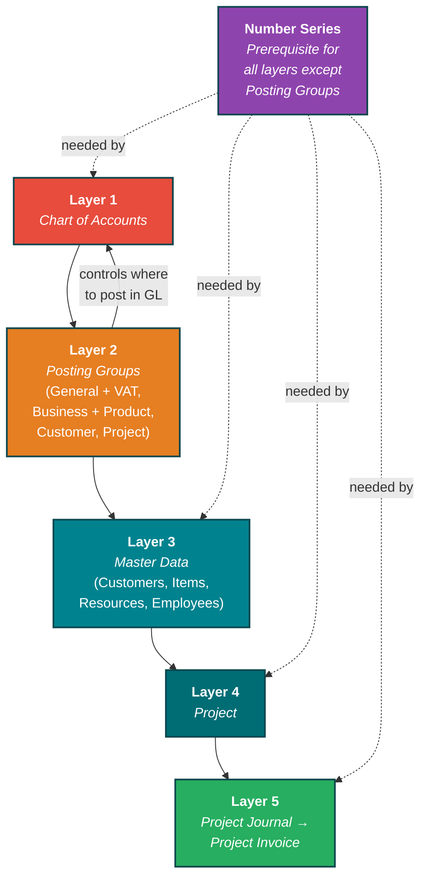
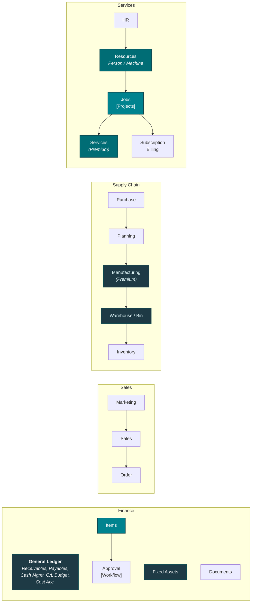
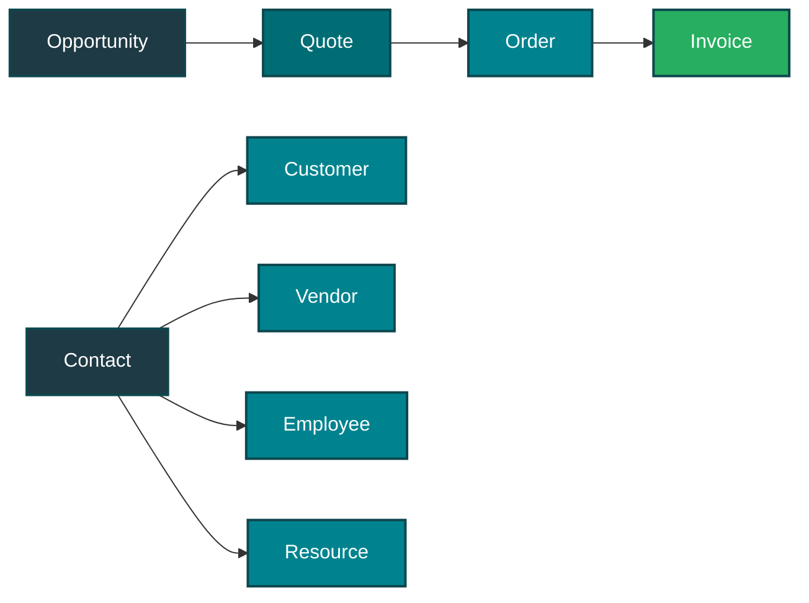
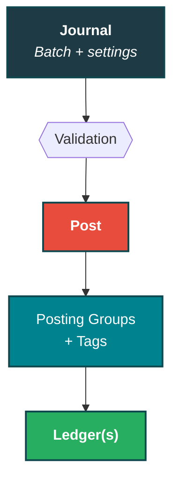
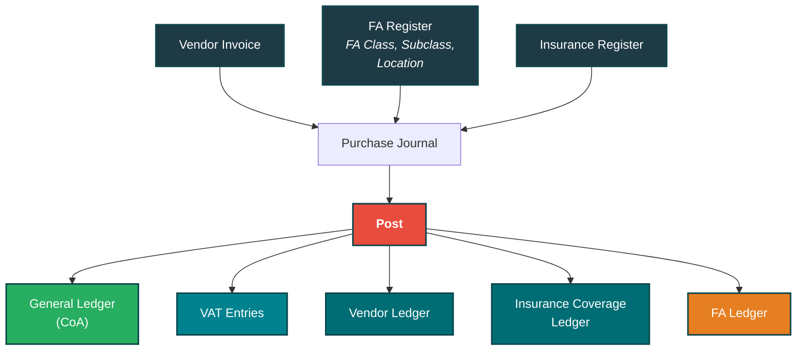
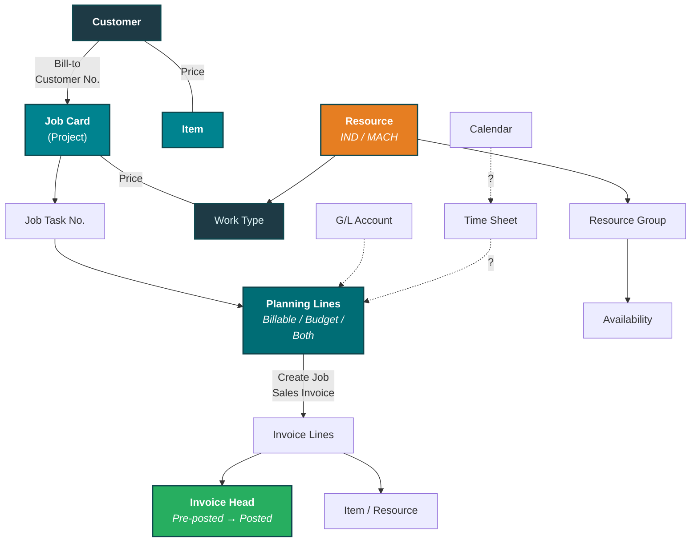
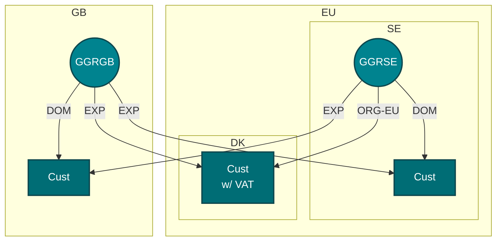
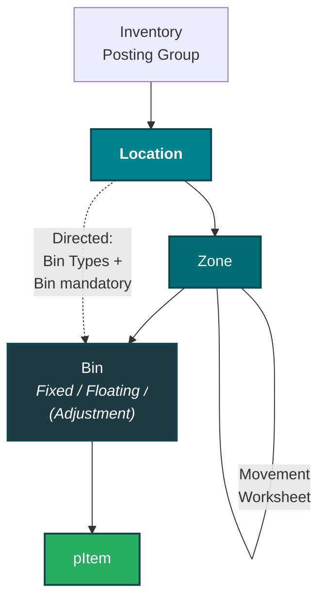

# Business Central — Tentixo Playbook

**Version**: 1.0
**Status**: Active
**Created**: 2026-05-26
**Updated**: 2026-06-09
**Scope**: BC knowledge capture — architecture, operations, bookkeeping, client status

> Living document. Captures what Chris has learned about BC from Morre, current client setups,
> and conventions to follow when working with Claude Code on BC-related tasks.

---

## 1. Context

**Me**: Chris Mansson, Client Director at Tentixo (Stockholm-based boutique Nordic cybersecurity + ERP advisory firm).

**Co-founder & technical lead**: Lars Mårelius ("Morre"). He's the deep BC operator and architect. He teaches Socratically — drills the architecture before the UI — and is strongly opinionated about doing things the "right" way the first time rather than patching later.

**My BC level**: Learning. Strong on commercial/strategic framing, conceptually solid on architecture, weak on UI muscle memory and edge cases.

**Active BC engagements**:
- **Tiny Minds Lab AB** (product: TinkyLär / "Tinky") — first practical setup. 18,000 SEK Heat Map engagement (incl. 2 workshops). Used as a real-world exercise to learn the full customer→project→invoice flow in Tentixo's sandbox.
- **Formpipe** — newly signed BC-support contract. Spinning up a new Microsoft tenant in October 2026. Engagement scope: optimise finance operations and evaluate which third-party integrations (TimeLog, Younium, Rillion, etc.) can be replaced by BC-native functionality.
- **Lasernet** — ongoing BC governance programme (separate engagement, less active for me personally).

---

## 2. How Morre teaches (working conventions)

When I'm getting help on BC tasks, default to these patterns — they match how Morre frames things:

- **Architecture before UI.** Always orient on which layer of the hierarchy you're touching (see §3) before walking through buttons and field names.
- **Think before you do.** For each step, name the decision being made and surface trade-offs explicitly rather than picking the obvious default silently.
- **Posting groups are the magic.** Most "how do I make BC do X" answers route through posting group setup, not workflow customisation.
- **Pricing belongs in price lists, not items.** Item Unit Price should usually be 0 (or a reference catalogue price). Customer-specific or project-specific prices override via price lists.
- **Resources = "we sell you". Employees = "you work for us".** Separate records, both needed for people-driven engagements.
- **Service-type Items, not Inventory.** Inventory type triggers stock tracking, negative inventory traps, valuation noise — wrong for consulting.
- **Transaction-based, not database-based.** BC's strength vs systems like TimeLog: posted entries stay in the ledger. Reversals create audit trail. Avoid any pattern that suggests "just edit the value."
- **"Correctness based on intent", not "best practice".** Morre avoids the term "best practice" — many so-called best practices are wrong (e.g., the DOMESTIC/EXPORT Gen. Bus. Posting Group split). Instead, evaluate setups by asking: does this reflect the *intent* of the transaction? Does it propagate correctly to legal, management, and reporting? The MVA principle applies: you cannot remove complexity, only move it. If the BC pattern generates work in another department, it hasn't followed MVA.
- **Learn by tracing the posting, not layer-by-layer ("glue a map").** *(Morre, Call 16)* For any new area — fixed assets, inventory, purchasing, payments — open its posting groups + posting setup, post *one* transaction, then look at **where it landed in the VAT ledger and the General Ledger**. Repeat until the map is complete. There are only **two ways to post: a journal or a document** — everything else is a special case of those two, so once the spine (CoA + posting groups + posting setup + journals-vs-documents) is solid, every module becomes legible.
- **Rim data vs. Crafted data — never let crafting depend on the Rim people.** *(Morre, Call 16)* **Rim data** is how you *legally* punch things in (booking a receipt/invoice, monthly FA depreciation, warehouse valuation). **Crafted data** is anything a human *decides* — account categories, aggregation/normalisation rules, posting-setup settings, analysis. The golden rule (the red "No!" arrow in `docs/FGGE-Machinery_v4.png`): a crafted decision must **never** create a dependency on the Rim-data people. Things you change often must not be baked onto Rim postings — this is the core reason to be sparing with dimensions (see §3.13).

---

## 3. Core architectural model

### 3.1 The dependency graph

Every layer depends on the one below. Get a lower layer wrong → everything above breaks. Posting groups point back to the Chart of Accounts (they control *where* transactions post in the GL).



**Number Series** are a prerequisite for every layer that creates records (CoA, Master Data, Projects, Transactions) — but *not* for Posting Groups (they are configuration, not records). If a number series isn't set up (e.g., Subscription Billing numbers missing from the sandbox), that entire module is blocked. Number Series sits alongside the hierarchy, not above it in a linear stack.

**Posting Groups → CoA**: The arrow from Layer 2 back to Layer 1 is intentional. Posting groups don't just depend on the CoA — they *control* which CoA accounts transactions land on. The General Posting Setup matrix maps (Business Group × Product Group) → G/L Account.

**The foundation spine (Morre, Call 16)** — the exam topics (fixed assets, dimensions, journals, purchasing, inventory) are not separate subjects; they're the *same machinery* applied in different places. Master the spine and the rest follows:

1. **Number Series** (technical layer) — manual vs automatic numbers. Bank accounts, employees and resources are *named, not numbered* (manual); a resource and its employee can share the same ID. The **employee register** is for anyone owed a *post-tax* payment — including a sub-consultant reimbursed for a client dinner (it's **debt on the balance sheet**), so separate posting groups keep *staff* debt distinct from *sub-consultant* debt.
2. **Chart of Accounts settings** — have a *sense* of every setting. The load-bearing one is **Direct Posting**: turn it **off** on ledger-linked accounts (AP/AR/VAT) so they can only move *through documents* (invoices/credit memos), blocking "fat-finger" manual edits that desync the sub-ledgers.
3. **Posting Groups + Posting Setup** — pointers to *where* to post; General + VAT Posting Setup are the combination matrices.
4. **Journals vs Documents** — the only two ways to post (auto-revaluations are just automatic journals).
5. **VAT statement & settlement** — see §6.1.

> Diagram: `docs/FGGE-Machinery_v4.png` (Morre's "Financial Governance & Compliance", v4) — governance levels (ORG → Group → External), the **Aggregation Machinery** (entity APIs → Aggregation → Normalize → Consolidation → View & Dig → Analyze & Report), and **The Loop** (Rim + Crafted → Combine → Analyze & Decide, with the red "No!" barring crafted data from writing back into Rim).

**Five "people" registers in BC** — the same person can appear in multiple registers, each serving a different purpose:

| Register        | Purpose                                   | Used by                                   |
|-----------------|-------------------------------------------|-------------------------------------------|
| Employee        | "You work for us" — payroll, HR           | Payroll, employment records               |
| Resource        | "We sell you" — billable rates            | Project Journal lines, time sheets        |
| Contact         | CRM — relationships, interactions         | Person Responsible on Project card         |
| User            | System login — controls who can post      | Project Manager, posting restrictions      |
| Customer/Vendor | Business entity                           | Invoicing, AP/AR                          |

*Person Responsible on the project card pulls from **Contacts**. Project Manager pulls from **Users** (or Employee/Resource — check which register the field draws from).*

### 3.2 GVH framework (Goods / Virtual / Human)

Tentixo's chart of accounts is organised around three sales categories. The CoA's intent is to expose **cost structure**, not just categorise the deliverable.

| Range | Type    | Cost driver            | Examples                        |
|-------|---------|------------------------|---------------------------------|
| 30xx  | Goods   | Physical, shipping     | Hardware resale                 |
| 31xx  | Virtual | Low marginal, self-serve | Licenses, electronic services |
| 32xx  | Human   | Employees, HR          | Consulting, advisory            |
| 34xx  | WIP     | Activated cost (work in progress) | Project costs before final invoice |

**34xx WIP — the activation layer**: Work in progress aggregates costs from Goods, Virtual, and Human without maintaining that granularity — it's just a value. The 34xx accounts are categorised by *why* something was activated (the reason for the WIP), not *what* was activated. When the final invoice is sent, activated costs move from WIP back into the granular 30xx/31xx/32xx categories. Check the 34xx sub-accounts to see the WIP split by activation reason.

**Litmus test**: if we remove humans, can we still deliver? If no → Human, regardless of pricing model. *Heat Map is Human (Consulting) — fixed price doesn't override delivery reality.*

**CoA intent = cost structure, not product type.** A Virtual item (e.g., a fixed-price package) can land on a Human/Consulting account (32xx) if it's human-bound — because the chart of accounts exposes *what costs the company carries* (employees, HR, shipping), not what the deliverable looks like. This is the conversation you need to have with every client and they never have time for.

**VAT subcategory — Electronic Service**: Within Virtual, there's a VAT-significant distinction. A license downloaded from a website = electronic service (specific VAT rules for cross-border EU). Same license shipped on a CD-ROM = still Virtual, but not electronic service. Reactive support *can* be electronic service if minimal human involvement; heavy support is just "service." The VAT Prod. Posting Group handles this (separate rows in the VAT Posting Setup for `S-FULL` services vs `S-ESVC` electronic services).

### 3.3 BC module map

*(diagram: `docs/BC_CentralParts-chris.png`)*



**Document lifecycle**:



**Contact is the root of "people"**: Contact → branches into Customer, Vendor, Employee, Resource. A single contact can spawn multiple entity types.

### 3.4 The WHO × WHAT posting matrix

BC's core elegance — and the lens Morre uses to evaluate every implementation:

- **Business Posting Group** on the Customer = WHO we sell to (Tentixo: `EXT`, `GRP-MOTH/DAUG/OTHR`, `CTRL-ASSO/JV/OTHR`)
- **Product Posting Group** on the Item/Resource = WHAT we sell (Tentixo: `C-MAIN1/2/3` consulting, `S-MAIN1/2/3` services, `G-*` goods)
- **General Posting Setup** = the matrix that maps every (WHO, WHAT) combination to a specific G/L revenue account
- **Same logic for VAT**: VAT Bus × VAT Prod → correct moms rate + accounts

**VAT Prod. Posting Groups must be semantic, not percentage-based.** Using `VAT25` as a posting group name is an anti-pattern — 25% is the Swedish rate, but the same item sold to an individual in Poland is 20%. If the group is called `VAT25`, you can't sell to Poland. Tentixo instead uses semantic codes with **relative rate steps**: `S-FULL`/`G-FULL` (full), `S-MED`/`S-LOW`/`S-SLIM` (reduced steps), `S-ESVC` (electronic services), `S-ZERO`/`G-ZERO` (exempt), plus reverse-charge variants (`S-REV_FULL`). BC's VAT Posting Setup matrix handles the country-specific percentage: it sees (who you sell to × what VAT category) and applies the correct rate (25% in Sweden, 20% in Poland, 0% for VAT-exempt). The percentage is a *result* of the matrix lookup, not an input. (`VAT25` survives only as the **VAT Identifier** for VAT-return grouping — a separate, acceptable use.)

**Individual ≠ physical person for VAT purposes.** An organisation can be an "individual" for VAT — NGOs, municipalities (kommuner), and other non-VAT-registered entities are treated as individuals in the VAT matrix even though they're organisations. The distinction is VAT registration, not legal form.

Companies that skip this either duplicate items (e.g., "Heat Map - Sweden" vs "Heat Map - Norway") or fall into dimension overload (Formpipe's pre-acquisition mistake).

### 3.5 Gen. Business Posting Group — the DOMESTIC/EXPORT anti-pattern

Separating Gen. Business Posting Groups into DOMESTIC, EU, EXPORT is a common "best practice" that Morre identifies as an **anti-pattern**. The problems:

- "Export" is hard to define cleanly — Ship-to, Pay-to, and Sell-to can all be different countries
- The information about *where* you sell to already lives on the Customer/Vendor card (country, VAT registration, addresses)
- Splitting it into the CoA via Gen. Bus. Posting Group would make the chart of accounts 5–7× larger (every cost account × every geography)

**What belongs in the CoA instead**: Intercompany posting splits — these are required for vanilla consolidation (combining subsidiary accounts into a group-level view). Morre's pattern:

| Intercompany split | Purpose |
|---|---|
| Loans | Track inter-entity lending |
| Warehouse items | Cross-company inventory movements (must track to keep warehouse correct) |
| Miscellaneous costs | Catch-all for shared costs (e.g., group-level marketing events) — don't be too granular, it disappears at group level anyway |

**The propagation test**: If you have a multi-entity group (e.g., Formpipe SE/DK) and a brand marketing event costs 100k — should you split that invoice between entities and then re-consolidate? No. It's a group-level cost. Splitting it per company and then aggregating in consolidation is circular work.

### 3.6 General Posting Type — the 5th tag

Morre's rule: **"If you use one of the four posting groups, you need all five."** The 5th control is the **General Posting Type**, which indicates the direction of the transaction:

| General Posting Type | Meaning |
|---|---|
| **Sale** | Revenue / outgoing to customer |
| **Purchase** | Cost / incoming from vendor |
| **Settlement** | Clearing / balancing entry |

BC often infers this automatically (posting a vendor invoice = Purchase), but on manual journal lines you must set it explicitly. Without it, BC can't resolve the posting group matrix correctly.

*(See Morre's posting diagram for visual placement of Gen Posting Type alongside the four posting groups.)*

### 3.7 Posting flow — how journal entries reach the ledger

*(diagram: `docs/BC-Posting-chris.png`)*



**G/L Account posting in detail** (e.g., document GJ1234):

1. General Journal entry in a batch
2. **Post** triggers the posting engine
3. Engine reads **Gen Posting Type** (Purchase / Sale / Settlement) and the **four posting groups**:

| Posting Group | Question it answers                            |
|---------------|------------------------------------------------|
| Gen Business  | **Whom?** (who are we doing business with)     |
| Gen Product   | **What?** (what are we selling/buying)         |
| VAT Business  | **Who + Where?** (jurisdiction of counterparty)|
| VAT Product   | **What + Level?** (what type, at what VAT rate)|

4. **"All Five or None!"** — Gen Posting Type + all four posting groups must be set together, or none at all. You can't partially specify.
5. Output: document number → **General Ledger (CoA)** entry on the resolved account (e.g., 3010), and VAT% matched by Biz+Prod → **VAT Entries** ledger.

### 3.8 Document posting — invoices and fixed assets

*(diagram: `docs/BC-Posting-from-document-chhris.png`)*

**Fixed Asset Vendor Invoice posting** — more complex, touches more ledgers:



- Prerequisites: FA Card must exist (FA Class, FA Subclass, FA Location). Insurance Card if the asset is covered.
- Tags: Posting Type, Document Type, FA Posting Type, Depr. Book Code
- Posting Groups: Gen Business, Gen Product, VAT Business, VAT Product, **Vendor**, **FA**

**Vendor Invoice Payment registration**:

- Purchase Journal (with Bank Account as balancing account) → Post → "Apply Payment to Invoice" on the Vendor Ledger
- Posting Groups: Vendor + Bank Account → writes to General Ledger + Bank Account Ledger

### 3.9 Project module ERD

*(diagram: `docs/BC-Project-ERD-Chris.png`)*



- **Planning Lines** are the journal entries: Billable, Budget, or Both Billable and Budget
- **"Create Job Sales Invoice"** pulls Planning Lines → Invoice Lines → Invoice Head
- **G/L Account** can also appear on Planning Lines (for non-item, non-resource costs)
- **Time Sheet** and **Calendar** connections shown with "?" — integration points that may or may not be enabled

### 3.10 VAT Business Posting Groups — geographic model

*(diagram: `docs/BC-VAT-pg-Chris.png`)*



- Each country has its own **GGR** (effectively the VAT Bus. Posting Group for that entity)
- **DOM** = domestic (same country), **EXP** = export (cross-border), **ORG-EU** = EU organisation (intra-community VAT rules)
- DK customer "with VAT" shows that some jurisdictions require VAT registration on the customer card
- This is why the WHO × WHAT matrix is so powerful — same item, different customer country, correct VAT treatment automatically

### 3.11 Warehouse module

*(diagram: `docs/BC-Warehous-ERD-Chris.png`)*

Not directly relevant for consulting/services, but important for Goods-type engagements and Formpipe's product lines.



**Inbound flow**: Purchase Order → Receipt (Released) → Put-Away (Released)

**Outbound flow**: Sales Order (Released) → Pick (Register) → Shipment (Post) → Invoice

If Bin is **not mandatory**: just "Recording" (simplified tracking without bin-level precision).

### 3.12 Why Project (not direct Sales Invoice) for "messy" engagements

Project model wins over direct invoicing when:
- Engagement is evolving, not a one-off transaction
- Mixed billing (fixed-price + hours + travel + future licenses) in one container
- Need analytical granularity per sub-element preserved through to invoicing
- Want budget vs actual and margin reporting

Keep recurring/subscription billing **outside** the project. Reasons (confirmed by Morre, June 2026):
1. Keeps project P&L clean (projects have a lifecycle; subscriptions don't)
2. Different legal requirements — subscription contracts and project contracts typically have different cancellation terms, liability clauses, and general conditions. Merging them breaks the one-to-one mapping with legal.
3. Multi-customer projects exist in BC (Gen. Bus. Posting Group set per line); subscriptions are always single-customer. Mixing risks confusion.
4. MVA: you cannot remove complexity, only move it. Merging creates downstream work in legal/operations.

### 3.13 Dimensions vs Cost Accounting (Morre, Call 16)

Morre's "never use dimensions" line, unpacked — and the friction with the MB-800 (which has a whole dimensions sub-area) resolved.

**Dimensions are not a module — they're 8 tag fields on a transaction.** Usage is trivial: define dimension *types* (categories), give them *values* (enums), then tag documents/transactions and filter/calculate by tag. **Learn the vanilla mechanics for the exam** (global vs shortcut, defaults, blocking combinations, priorities, dimension correction) — that part is simple.

**Why Morre minimises them — calcification.** A dimension put on a posting is **forever**. The moment you use dimensions to carry a *crafted decision* — e.g. splitting an invoice 60/40 across two departments — that decision is baked onto the Rim posting. To change it to 50/50 you must send the Rim people to reverse and re-post (the employee-moves-department problem: revert 200 postings, or do a manual correction). That is exactly the Rim-vs-Crafted dependency the golden rule forbids (§2). Dimensions are the "nuclear option": fine as tags, dangerous as a home for decisions you'll revise.

**Cost Accounting — the architectural alternative.** A **totally separate ledger** ("think of it as a separate chart of accounts"). Cost accountants re-allocate freely (60/40 → 50/50) in *their* ledger without ever touching the original Rim posting. Dimensions and cost accounting "stand against each other" — you use one or the other for cost allocation. Cost accounting can lean on dimensions but isn't strictly dependent on them.

> **Not in the MB-800 basic exam** — but Morre wants it added *"because we most likely will use it for Formpipe."* Study it for capability, not the cert. Setup is empty in the sandbox today (Morre hasn't built it yet — AI-assist candidate).

---

## 4. Operational playbook — the 8-step flow

Morre's prescribed order for setting up a new consulting engagement. Order matters because of layer dependencies.


### Step 1 — Customer

| Field                    | Tentixo convention (domestic SE B2B) |
|--------------------------|--------------------------------------|
| Gen. Bus. Posting Group  | `EXT`                                |
| VAT Bus. Posting Group   | `EXT`                                |
| Customer Posting Group   | `EXT` (external customer → AR 1511)  |
| Country/Region Code      | `SE`                                 |
| Registration No.         | org.nr (e.g. `5566778899`)           |
| VAT Registration No.     | `SE` + org.nr + `01`                 |
| Payment Terms            | `30D`                                |

`Registration No.` is on General FastTab (newer BC) or Invoicing FastTab (older). Don't confuse with `VAT Registration No.`

### Step 2 — Contact

Creating a Customer auto-creates a company-type Contact card. Open it and **add person contacts** (decision-maker, billing/AP, technical lead).

Watch for duplicate contacts if the same company is both customer and vendor (Idonex pattern). Merge via Contact → Actions → Merge.

### Step 3 — Item (Service-type)

| Field                    | Value                                |
|--------------------------|--------------------------------------|
| Type                     | `Service`                            |
| Base Unit of Measure     | `EA` (international standard; PCS maps to EA internally) |
| Gen. Prod. Posting Group | `C-MAIN1` (Consulting, human-bound delivery → revenue 3211) |
| VAT Prod. Posting Group  | `S-FULL` (Services full VAT — not `VAT25`; see §3.4 on why percentage-based names are an anti-pattern) |
| Inventory Posting Group  | blank                                |
| Unit Price               | `0` or reference/catalogue price (real prices via price lists — see §5.4) |

### Step 4 — Resource (the "we sell you" side)

| Field                    | Value                                              |
|--------------------------|----------------------------------------------------|
| Type                     | `Person`                                           |
| Base Unit of Measure     | `HOUR`                                             |
| Unit Cost                | `560` (my internal cost rate)                      |
| Unit Price               | `1400` (default sell rate — override per client/project) |
| Gen. Prod. Posting Group | `C-MAIN1` (Consulting)                              |
| VAT Prod. Posting Group  | `S-FULL` (Services full VAT — semantic, not percentage-based) |

**Trap**: Unit Cost and Unit Price sit next to each other. Don't change Unit Cost when you mean Unit Price (Morre caught me on this).

### Step 5 — Employee (the "you work for us" side)

Parallel record to Resource. Where the Resource card links via `Employee No.`, populate it. Payroll-side setup is a separate workstream.

### Step 6 — Project

| Field                 | Value                                                  |
|-----------------------|--------------------------------------------------------|
| Bill-to Customer No.  | the customer                                           |
| Project Posting Group | a consulting-aligned group with WIP account configured |
| Status                | `Open`                                                 |
| Person Responsible    | the lead consultant                                    |

**Project Tasks**: start with **one** posting-type task (e.g., `1000 Heat Map`). Add sub-tasks only when engagement splits (retainer + project work, or pre-study/execution/post). Don't pre-optimise.

**WIP method must match project type.** If a T&M project has WIP method set to "Fixed Price" (or vice versa), the WIP postings hit the wrong chart-of-accounts entries. Check WIP Method on the project card before any WIP calculation.

### Step 7 — Project Journal

**Journal batch hygiene**: Before posting, check which batch you're in (top of the journal page). Batches let multiple people work in the same journal simultaneously without collisions. There's a dedicated **API batch** with its own number series — never post manually to it. Use the `DEFAULT` batch for manual work.

**Fixed-price vs T&M — the line type split** (Morre, June 2026):

| Billing model | Item lines | Resource lines | Rationale |
|---|---|---|---|
| **Fixed price** | **Billable** (the invoiceable deliverable, e.g., HM-LITE @ 18k) | **Budget** (effort tracking only — hours don't appear on invoice) | Separates what the client pays for (deliverable) from the work that goes in (effort). Budget = internal cost visibility. |
| **T&M** | Usually not needed | **Both Billable and Budget** | Hours are both the cost unit and the billing unit — same line serves both purposes. |

Example — fixed-price Heat Map:
```
Line 1 (revenue capture):
  Type=Item, No.=HM-LITE, Project Task=1000, Qty=1,
  Unit Price=18000 (override), Line Type=Billable

Line 2 (cost capture):
  Type=Resource, No.=CHRIS, Project Task=1000, Qty=16,
  Line Type=Budget
```

For T&M: Resource lines are `Both Billable and Budget`, no separate Item line needed.

**Posting date shortcuts**: Type `T` + Tab for today's date. For prior months, type the short date directly (e.g., `0430` for April 30).

**Unit Price vs Unit Price (LCY)**: If the project is in a foreign currency, set the price in `Unit Price`. `Unit Price (LCY)` is the local-currency equivalent and auto-calculates. For SEK projects, they're the same — but edit `Unit Price`, not the LCY field.

**Late hours**: Post old hours to the correct past month (posting date = when the work happened). BC's invoicing picks up anything uninvoiced regardless of date, so late-reported hours get captured automatically on the next invoice run.

Post the journal (F9).

### Step 8 — Create Project Invoice

**Two ways to create the invoice:**
1. **Global**: Search → "Create Project Sales Invoice" → OK. Takes all uninvoiced billable lines across projects.
2. **Per task line**: From the project task, Manage → Line → Documents → Create Sales Invoice. Invoices just that task — useful when you want to bill pre-study separately from execution.

The draft Sales Invoice is linked to the project. **Project-linked lines are locked** — you can't change quantities or prices on them. You *can* add extra lines (e.g., comments, one-off charges), but those additions won't be tracked in the project.

**Work Description field** (under "Show more" on the invoice header): Text that appears above the line items on the printed invoice. Use it for engagement descriptions, period references, etc.

Review header/lines/Statistics (F7), then Post & Send.

**Invoice structure (useful for API work)**: An invoice is just Head + Lines. The "head" contains everything that visually appears in the header *and* footer of the printed invoice — customer, payment terms, dates, addresses. Lines are the billable items.

After posting, the project ledger marks those lines as "invoiced" (a dot/boolean). **BC will never invoice the same line twice** — this is the core safety net for automation.

After posting, open Project Statistics for budget vs actual, billable vs non-billable, cost vs revenue, margin.

---

## 5. Bookkeeping fundamentals

*From Morre session, June 2026*

### 5.1 Double-entry: always zero

Every transaction has a plus and a matching minus — the books must always net to zero. This is "double-entry Italian bookkeeping." Start every transaction by thinking about the bank: did money come in, go out, or stay?

**The sign convention** (counterintuitive until you internalise it):

| Account type       | Sign  | Why                                                              |
|--------------------|-------|------------------------------------------------------------------|
| Bank (assets, 1000s)     | **+** | You have money — makes sense                              |
| Liabilities (2000s)      | **−** | You owe money — balances the asset                        |
| Revenue (3000s)          | **−** | A sale puts + in the bank, so the revenue entry must be − |
| Costs (4000s+)           | **+** | Paying salary takes − from the bank, so the cost entry is + |

**Example — share capital**: Shareholders invest 100,000. Bank = +100,000, Share Capital = −100,000 (you owe it back). Net = zero.

**Example — salary**: Pay 10,000 salary. Cost = +10,000, Bank = −10,000. Net = zero.

**Example — sale with VAT**: Sell 80,000 + 20% VAT = 100,000 collected. Bank = +100,000, Revenue = −80,000, VAT liability (2640) = −20,000. Net = zero.

### 5.2 Chart of accounts — the number logic

| Range       | Type                | Sign  | What lives here                              |
|-------------|---------------------|-------|----------------------------------------------|
| 1000s       | Assets              | +     | Bank (1930), fixed assets, receivables       |
| 2000s       | Liabilities         | −     | Loans, VAT payable (2640), share capital     |
| 3000s       | Revenue             | −     | Sales income                                 |
| 4000s       | Cost of goods sold  | +     | Costs directly tied to a sale (mirror of 3000s) |
| 5000s–7000s | Operating costs     | +     | Salaries, depreciation, rent, etc.           |

**The 3000/4000 mirror**: Revenue account 3011 (goods revenue) pairs with 4011 (purchase of goods). Same structure — one digit apart. This is deliberate.

**GVH+W in the 3000s** (Tentixo/Formpipe convention):
- 30xx — Goods
- 31xx — Services (virtual, low-marginal)
- 32xx — Human (consulting)
- 33xx — Odd sales (one-offs you want separated from core revenue)
- 34xx — Work in Progress (activated costs — see §3.2)

**Tree rule**: The chart of accounts is a tree (each account has one parent). If you use granular child accounts, you must not also post to the parent — they overlap. Pick one level. *(Formpipe violated this with manual bookings — led to confusion.)*

### 5.3 Cost vs. investment — fixed assets

Buying something expensive (a building, equipment) is not a cost — it's converting one asset form (cash) to another (fixed asset). Both stay on the balance sheet:

- Bank (1930) = −1,000,000 (cash out)
- Fixed Asset (e.g., buildings) = +1,000,000 (value in)

Net effect on income statement: zero. You looped within the balance sheet.

### 5.4 Depreciation and appreciation

**Depreciation**: The asset wears down. Each year, move value from the balance sheet to the income statement:
- Fixed Asset = −10,000 (value decreases)
- Depreciation cost (e.g., 7821) = +10,000 (cost recognized)

**Appreciation**: A repair increases the asset's value beyond what was there:
- Bank = −20,000 (paid for repair)
- Fixed Asset = +20,000 (value increases)
- Appreciation account (7xxx) = −20,000 (effectively profit — you created value)

### 5.5 Revenue recognition — when did it happen?

**Critical distinction** (Swedish terms are more precise than English here):

| Swedish          | English    | What it means                                                        |
|------------------|------------|----------------------------------------------------------------------|
| **Inbetalning**  | Payment in | Cash hits the bank (balance sheet event)                             |
| **Intäkt**       | Revenue    | The earning event — when you can say "I earned this" (income statement event) |

These are **different events at different times**. Getting paid in advance ≠ earning the revenue. Invoicing in June for May work → revenue belongs in May, not June. The income statement cares about *when the value was delivered*, not when cash moved.

### 5.6 Work in progress (WIP) and recognized revenue

IFRS requires showing revenue you know you'll earn (signed contracts, partially completed projects) — otherwise the company looks undervalued.

**The mechanism**: Book revenue as − (income statement) and a matching + on a "fake bank account" (a WIP/recognized receivable on the balance sheet). When the real invoice goes out, cancel both entries and replace with the real sale + real receivable.

**BC-specific flow**: Project module handles this. Mark project as X% complete → press a button → BC books the WIP entries. When you create the actual invoice, the WIP entries get reversed automatically.

**BC "shipped not invoiced"**: Goods shipped but not yet invoiced sit on a specific account — this is the "fake money" that represents revenue earned but not yet billed.

### 5.7 Pre-booked revenue from signed orders (the Formpipe/HubSpot pattern)

When a firm order is signed (e.g., 12-month contract), BC books forward-looking revenue:
1. Signed order creates 12 monthly sales orders in BC
2. Each month, order → invoice, which cancels the pre-booking and replaces it with a real entry
3. Revenue moves from "recognized/pre-booked" to "actual" one month at a time

### 5.8 Incoterms — when risk transfers

For physical goods, the revenue event depends on **Incoterms** (international trade terms, ~200 years old):
- **Ex Works**: risk transfers when buyer picks up the package outside your warehouse
- **Alongside Ship**: risk transfers at the crane — quay side vs. ship side determines whose insurance pays

The point: there must be zero ambiguity about *when* the sale happened. Bookkeeping follows the risk transfer, not the payment.

### 5.9 Year-end close — moving the result to the balance sheet

*(Morre, Call 16)* The income statement is closed every year and must net to zero. Summarise revenue and cost → you get the year's result. That result has to be **moved to the balance sheet**: a profit is booked as "a cost called profit" so the P&L zeroes out and equity grows ("we grew our money in the company"). A loss works the mirror way. This is a distinct *operation* (year-end close), not day-to-day posting — one of the D4 exam topics.

### 5.10 Account categories & financial reporting — the aggregation layer

*(Morre, Call 16)* The 1,400-account CoA is too granular for management to read (Formpipe don't want to look at 1,400 accounts). BC's built-in aggregation solves this:

- **Account Categories → Subcategories** (two levels). Each G/L account links to a category; BC sums the granular child accounts into categories **every night**, so you get a daily income statement / cash flow in the shape the company wants.
- **Set up manually per company** — this is *crafted data* (§2), and it **cannot** be pushed via a config package. Two entry points: edit on the category, or on the G/L account (they mirror). Use **"view uncategorised accounts"** as a completeness check — any 4-digit account still showing means one was missed.
- **Different intent from bookkeeping.** You don't need account categories to get the numbers out for VAT or an income statement — they're for *analysis*, not correctness. Keep the two separate.
- **Drill-down needs Power BI.** Reports show totals only; to click a category down to its granular child accounts you need Power BI (the VAT statement preview has partial drill-down). This is *why* Formpipe/Therese's "single source of truth" ask lands in Power BI (§12).

---

## 6. Operational patterns (from Masha sessions)

*See `ai/reports/masha-bc-sessions.md` for full session notes. Below captures what's generally useful.*

### 6.1 Swedish VAT rates in practice

| Rate | VAT Prod. Posting Group | Applies to                                           |
|------|------------------------|------------------------------------------------------|
| 25%  | Standard               | Most goods and services in Sweden                    |
| 12%  | Medium                 | Hotels in Sweden, restaurant food in Sweden          |
| 6%   | Low                    | Domestic transport (cabs, flights within SE)         |
| 0%   | Zero                   | Foreign services, international flights, insurance, health, banking |

**Location-based rule**: VAT rate follows where the service is consumed, not purchased. Swedish hotel = 12%. Spanish hotel = 0%. Cab in Amsterdam = 0%. Cab in Stockholm = 6%.

**Split-VAT transactions**: When one bank line contains items at different rates (e.g., Uber ride + tip), post as multiple journal lines under the **same document number**. Each line gets its own posting groups. Bank balancing line has no posting groups. Total must be zero.

**Business dinners**: Max 300 SEK/person deductible. Alcohol is always non-deductible. Only the food portion (up to the limit) gets 12% VAT.

**VAT statement & settlement (the process)** *(Morre, Call 16)* — two distinct steps, and an MB-800 topic:
- **VAT statement** validates the *report* — it reads the VAT entries and lets you check the numbers before you commit.
- **Settlement** actually *moves* the money between accounts. Ongoing VAT sits on separate accounts — SE **output 2610** / **input 2640** — and on settlement the net is swept to **2650** (what you owe the Swedish tax office). EU items settle to **2690**. You need to know *when* VAT posts to the VAT ledger and when it doesn't.
- **MOSS quirk.** A non-VAT-registered buyer is treated as an *individual*; cross-border B2C VAT (e.g. a French sale) is owed to *that* country. It's parked in a **single clump-sum account** for all non-SE countries (no room for one account per country) — the per-country granularity lives in the VAT ledger. There's **no MOSS VAT report yet** (Morre is behind on that one).

### 6.2 Fixed assets — Swedish thresholds

| Category              | Value range        | Depreciation                         |
|-----------------------|-------------------|--------------------------------------|
| **LVA** (low-value)   | 2,000–20,000 SEK  | Written off immediately at acquisition |
| **Main fixed asset**  | > 20,000 SEK      | Depreciated over N years (e.g., 3 years for laptops) |

- Post acquisition cost via **Fixed Asset Journal** (amount ex-VAT — VAT already handled in the receipt posting)
- For main assets: run **Calculate Depreciation** monthly (Project card → Actions → Tasks). Creates journal lines moving value from FA account to depreciation expense account.
- LVA: depreciation start date = end date → book value immediately zero.
- On disposal: post in FA journal, then **manually** set FA card to Inactive + Blocked (disposal posting doesn't update the card status automatically).

### 6.3 Payment reconciliation via bank XML

Semi-automated matching of bank transactions to open invoices:

1. Download XML transaction file from bank (monthly)
2. BC: Payment Reconciliation Journal → Import Bank Transactions → upload XML
3. BC auto-matches most transactions to open invoices
4. Remove receipt lines (already posted as G/L entries)
5. Validate matches — check that BC picked the correct invoice (watch for same-amount different-month false matches)
6. Post the reconciliation

This is the main mechanism for "gluing" payments to invoices at scale. For one-off manual matching: Sales/Purchase Journals → Payment document type → Apply Entries.

### 6.4 Foreign currency — exchange rate gain/loss

When paying invoices in foreign currency (EUR, USD), the exchange rate at invoicing vs. payment creates a difference:

- **Exchange losses** (overpayment, account **7960**): BC offers "Transfer Difference to Account" in the payment reconciliation — one-click resolution.
- **Exchange gains** (underpayment, account **3960**): This option is **not available** in BC. Must create a manual G/L journal entry to record the gain — **remove the currency** on the journal line so the correction posts in SEK. Masha considers this a BC bug; worth verifying with Morre whether it's a configuration issue.

### 6.5 Employee reimbursements

When an employee pays a company expense from a personal card:

- Post the expense to the correct G/L account, but use **Employee account** (not bank) as balancing account
- Creates an open entry on the employee ledger (company owes them)
- Apply against salary or separate reimbursement payment to close the entry

### 6.6 Deferrals — putting costs and revenue in the right period

*From Masha session, June 11 2026*

Deferrals move a cost or revenue entry to the period where it actually belongs — critical for correct reporting and WIP. BC handles this via **deferral codes** on journal lines, purchase invoice lines, and sales invoice lines.

**Tentixo deferral codes** — 6 presets (3 cost, 3 revenue):

| Code type | Direction | Use case |
|---|---|---|
| Cost backward | Past | Invoice received today for last month's service (e.g., Hompland cleaning) |
| Cost forward | Future | Prepaid expense — booked today for next month |
| Cost spread | Multiple periods | Quarterly invoice spread across 3 months (e.g., telecom at 9,000 SEK/quarter → 3 × 3,000) |
| Revenue backward | Past | T&M sales invoice sent in June for May's hours → revenue belongs in May |
| Revenue forward | Future | Prepaid revenue (deposit for future work) |
| Revenue spread | Multiple periods | Annual contract revenue spread across 12 months |

**How to apply (General Journal)**:

1. Set up the journal line as usual (all 5 posting groups + posting type)
2. Select **Deferral Code** on the line
3. Click the `...` to open the deferral schedule
4. **Backward**: manually set the start date (BC doesn't auto-populate for past dates)
5. **Forward**: auto-calculates the future date
6. **Spread**: set the number of periods + start date
7. Click **Calculate Schedule** → shows deferred amounts per period (amounts are ex-VAT)

Same workflow on **Purchase Invoice** and **Sales Invoice** lines — the Deferral Code column is available on invoice line subpages.

**When deferrals fire**: VAT posting and deferral posting both happen at the moment of **posting the invoice**. When payment arrives later, it just "glues" to the invoice — no deferral adjustment needed.

**On the Chart of Accounts**: Deferral postings appear alongside the invoice posting under the same document number. The invoice amount and the deferral amount cancel each other out in the posted month; the deferred amount appears in the correct period.

**Tentixo threshold rule**: Only defer amounts ≥ **2,000 SEK/month** (≈ 24,000 SEK/year). Below this, the deferrals create too many small lines on reports and are hard to validate. Examples:
- Adobe Suite (~10,000/year) → **not deferred** (below threshold)
- Google Workspace (~300–500/month) → **not deferred** (stopped — too much mess)
- Hompland cleaning (above threshold) → **deferred** backward to service month
- T&M sales invoices → **always deferred** (revenue backward to work month)

**Quarter-close pragmatism**: If Q1 is closed and a Q1 invoice arrives in Q2, book it in Q2 rather than reopening Q1 reporting. Correctness vs. rework tradeoff — not perfect, but avoids redoing the quarterly report.

**Travel expenses**: Airplane tickets or hotels booked in advance → defer to the month of actual travel, not the purchase date.

### 6.7 Journal batch presets

BC allows different journal batches with different default balancing account types. Useful for workflow efficiency:

- "Danske" batch → default balancing = Bank Account (for receipt posting)
- "Default" batch → default balancing = G/L Account (for salary distribution, tax entries)
- "API" batch → reserved for automated postings (never use manually)

**Saved journal templates** ("Standard Journals"): Pre-populated recurring entries (e.g., monthly salary lines). Load template, verify amounts, post. Useful when the same accounts repeat but amounts vary.

---

## 7. Common gotchas (lessons learned the hard way)

- **Wrong tenant**: Tentixo company vs Cronus demo. Check top-right tenant selector before anything else.
- **Inventory item type for services**: triggers negative inventory + valuation drama. Always `Service` for what we sell.
- **Unit Cost vs Unit Price** on the Resource card: adjacent fields, easy to confuse. Cost = what I cost the firm; Price = what the firm sells me for.
- **Hard-coded prices in items**: don't. Use price lists. Items at 0 (or reference price), overrides on the project/invoice line.
- **Project Journal columns scrolled off-screen**: Project Journal lines have ~20 columns; only the leftmost fit. Personalize the layout (gear icon → Personalize) and pull Quantity, Unit Price, Line Type into view. Hide irrelevant ones (Location Code).
- **Job vs Project terminology**: Microsoft renamed Jobs → Projects in BC 2023 wave 1. Older sandboxes/extensions may still say "Job Journal". Same functionality.
- **VAT lookup populates address on one line**: cut/paste into separate fields.
- **Country/Region = SE is mandatory** for VAT validation.
- **Finalize WIP before closing a project**: If a project is at 90% WIP and you close it without running the final WIP calculation, the cancelling entries don't fire — you're left with orphaned WIP postings and manual cleanup. Always run WIP to 100% (or final state) before changing project status to closed.
- **Don't mix parent and child accounts in the CoA**: Post to either the summary account or its children, never both. Formpipe did this with manual bookings and it obscured what was what.
- **Cancelling entry on the wrong account type**: In the Formpipe/Sikri carve-out, a correction for a prepaid contract (2171) was accidentally booked to a post-pay account (1470). Automated code correctly treated it as post-pay, producing a ~500,000 SEK discrepancy. Then a manual fix compounded the error (minus instead of plus — doubling the mistake). Lesson: the account you post to determines how code and reports interpret the entry. A "small" misposting cascades.
- **Exchange rate gain asymmetry**: BC can auto-transfer exchange losses (overpayment) to the loss account via "Transfer Difference to Account" in payment reconciliation. But exchange gains (underpayment) require a manual journal entry — the auto-transfer option doesn't appear. Possibly a bug, possibly a configuration issue. Check with Morre.
- **FA disposal doesn't update the card**: After posting a disposal in the Fixed Asset Journal, the FA card status remains active. Manually set to Inactive + Blocked, otherwise it clutters the active asset list.

---

## 8. Tentixo posting group conventions (sandbox state)

| Group type                | Codes in use                                                                                              |
|---------------------------|-----------------------------------------------------------------------------------------------------------|
| Gen. Bus. Posting Group   | `EXT`, `GRP-MOTH/DAUG/OTHR`, `CTRL-ASSO/JV/OTHR` (✅ reviewed — intercompany/group structure, **no** DOMESTIC/EXPORT geo split per §3.5) |
| VAT Bus. Posting Group    | `DOM`, `EXP`, `ORG-EU`, per-country `IND-XX`, `VND-IND`, `SELF` (the country matrix)                       |
| Customer Posting Group    | `EXT` (1511 AR), `GRP-MOTH/DAUG/OTHR` (1564/1565/1566), `CTRL-ASSO/JV/OTHR` (1577/1578/1579), `SKV` (1513, ROT/RUT deduction) |
| Gen. Prod. Posting Group  | `C-MAIN1/2/3`, `C-MISC` (consulting); `S-MAIN1/2/3`, `S-MISC` (services); `G-MERCH/FINISHED/SEMI/RAW/ADD_NESS/MISC` (goods) |
| VAT Prod. Posting Group   | `S-FULL`, `G-FULL`, `S-ESVC`, `S-ZERO`/`G-ZERO` + reduced steps `S-MED/LOW/SLIM` — already semantic (no correction needed) |
| Project (Job) Posting Group | `J-EXT` (external default), `J-GRP-*`, `J-CTRL-*` — WIP wired to 34xx/44xx (see WIP codebook)            |

**Consulting revenue segments** (`C-MAIN1/2/3` → revenue 3211/3221/3231) — *Morre, June 15 2026*:
- The `1/2/3` split has **no fixed meaning** — it is the **organisation's choice**, answering **"What are you selling, Where, and How?"** It's a revenue-segmentation decision per business, not a Tentixo standard.
- The earlier placeholder narrative (employees / sub-consultants / under-education) was wrong for the *revenue* side. **Staff / Contractors / Under-education is a cost-side concept on `4nnn` accounts**, not a Gen. Prod. revenue group.
- **CoA-granularity principle**: the chart of accounts (and the IS/BS reports built from it) is deliberately **low granularity** — "what you always want to see, and is *safe to show the bank* without leaking high-granularity competitive detail." High granularity belongs elsewhere (projects, registers, Power BI), not in the CoA.

---

## 9. Terminology cheat sheet (EN ↔ SV)

| English                  | Swedish                      | Notes                                                      |
|--------------------------|------------------------------|------------------------------------------------------------|
| Chart of Accounts        | Kontoplan                    | BAS-kontoplan is the Swedish standard                      |
| Posting Group            | Bokföringsmall               | Often kept in English                                      |
| General Posting Setup    | Allmän bokföringsinställning  | The WHO×WHAT matrix                                        |
| Customer Posting Group   | Kundbokföringsmall           | Drives AR account                                          |
| Item                     | Artikel                      | Service-type for consulting                                |
| Resource                 | Resurs                       | Type=Person for consultants                                |
| Project (was: Job)       | Projekt                      | Renamed BC 2023 wave 1                                     |
| Project Journal          | Projektjournal               | Where hours/items hit the project                          |
| Project Ledger           | Projektreskontra             | The transaction record                                     |
| WIP                      | PIA (Pågående arbete)        | Work in progress                                           |
| Registration No.         | Organisationsnummer          | Bolagsverket ID                                            |
| VAT Registration No.     | Momsregistreringsnummer      | `SE` + org.nr + `01`                                       |
| ORG Scheme               | Identifierarschema           | Peppol e-invoicing identifier code                         |
| EORI                     | EORI                         | EU customs ID — services don't need it                     |
| T&M                      | Löpande räkning              | Modern usage often just "T&M"                              |
| Retainer                 | Retainer-avtal               | Modern Swedish                                             |
| Double-entry bookkeeping | Dubbel bokföring             | Italian origin — every entry needs a balancing counter-entry |
| Balance sheet            | Balansräkning                | Assets (1000s) and liabilities (2000s) — must net to zero  |
| Income statement         | Resultaträkning              | Revenue (3000s) and costs (4000s+) — profit and loss       |
| Revenue (the event)      | Intäkt                       | When you earned it — not when cash arrived                 |
| Payment in               | Inbetalning                  | When cash actually hits the bank                           |
| Depreciation             | Avskrivning                  | Annual write-down of fixed asset value                     |
| Appreciation             | Uppskrivning                 | Increase in asset value (e.g., renovation)                 |
| Fixed asset              | Anläggningstillgång          | Long-lived asset on balance sheet, not expensed immediately|
| Recognized revenue       | Upparbetad intäkt            | Revenue booked before invoicing (WIP / IFRS requirement)   |
| Shipped not invoiced     | Levererat ej fakturerat      | Goods/services delivered but invoice not yet sent          |
| Incoterms                | Incoterms                    | International trade terms defining when risk transfers     |
| Prepaid                  | Förskottsbetald              | Payment received before service delivered (liability until earned) |
| Electronic service       | Elektronisk tjänst           | VAT subcategory of Virtual — self-serve, no human involvement |
| Journal batch            | Journalgrupp                 | Envelope for journal entries; separate batches for API vs manual |
| Base Unit of Measure     | Basenhet                     | International code matters for e-invoicing (EA = each, not PCS) |

---

## 10. Useful shortcuts

| Shortcut                     | What                                                             |
|------------------------------|------------------------------------------------------------------|
| `Alt+Q`                      | Tell Me search (find any page/action)                            |
| `F7`                         | Statistics on current document                                   |
| `F9`                         | Post                                                             |
| `T` + Tab (in date field)    | Today's date                                                     |
| Gear icon → Personalize      | Customise column layout per page (per user, safe to change)      |
| Right-click column header    | Hide / re-order columns                                          |
| Renumber Document Numbers    | Action in journals to fix numbering gaps after batch work        |

---

## 11. Active client status

### Tiny Minds Lab AB

- **Engagement**: Heat Map project (incl. 2 workshops), agreed 18,000 SEK ex moms
- **Customer card**: created in Tentixo sandbox. VAT validated, address populated (had to cut/paste from one-line VAT lookup). Country/Region SE set.
- **Contact card**: auto-created from customer. Person contacts to be added.
- **Item**: `HM-LITE`, Service type, Gen. Prod. `C-MAIN1`, VAT Prod. `S-FULL`. Unit Price = 0 (override on invoice). Morre set a reference price of 28k on the item — acceptable as a catalogue reference.
- **Resource**: Chris (Person, HOUR, Gen. Prod. `C-MAIN1`, VAT Prod. `S-FULL`, cost 560, price 1400)
- **Employee**: Chris — record exists, linked to Resource
- **Project**: linked to Tinky, one task (`ITSEC`). Person Responsible = Chris (from Contacts). WIP method = Sales Value.
- **Status**: **First invoice posted** (May 27, 2026). Item line: 1× HM-LITE @ 18,000 SEK. Posted to ledger, visible in posted sales invoices.
- **Open question**: keep as catalogue SKU (HM-LITE with override pricing) or as one-off custom item? Morre says keep same item, override price via price lists — don't lock pricing into the item.

**Billing decision (Morre, June 9 2026) — Option A confirmed:**
- **Retainer** (15k/month fixed) → Subscription Billing module. Separate contract, automated monthly invoicing.
- **Ad-hoc projects** (quoted fixed price) → Project Billing. New project per engagement, same 8-step flow.
- **Two separate invoices** to Tinky when both streams active. Morre confirms this is correct — reasons:
  1. *Intent separation*: subscription is fixed/predictable, project is messy/evolving. Different containers for different intent.
  2. *Legal separation*: subscription and project may have different contractual terms (cancellation, liability, general clauses). Merging them loses the one-to-one mapping with legal requirements.
  3. *Multi-customer projects*: projects can span multiple customers (Gen. Bus. Posting Group set per line). Subscription billing is always one customer. Mixing them risks confusion if someone opens a multi-customer project.
  4. *MVA principle*: you cannot remove complexity, you can only move it. Merging billing streams moves complexity into legal/operations departments. Keep it where it belongs.
- **Aggregation in Power BI**: use the Customer card (org ID) to unify retainer and project revenue in reporting. The aggregation layer is Power BI, not the invoice.
- **Edge case for later**: Python API scripts can generate custom invoices if a client genuinely needs a single combined document. But start with the correct architecture.
- See `ai/reports/tinky-billing-scenarios.md` for the full three-scenario analysis.

**Subscription Billing setup (completed June 12, 2026):**

Setup sequence: Subscription Contract Setup (number series + arrange texts) → Item → Customer Subscription Contract → Billing Template → test billing run.

- **Subscription Contract Setup** (global config):
  - Number Series assigned: `S-CON` (Customer Contracts), `P-CON` (Vendor Contracts), `SUB-NO` (Subscriptions)
  - Defaults: Billing Base Period `1M`, Billing Rhythm `1M`, Period Calculation "Align to Start of Month", Deferrals "Contract-dependent"
  - Invoice Details → Arrange Texts → Description = **"Billing Period"** (required — without this, Create Documents fails with "Faktureringsperiod" error)
- **Item**: `SEC-RETAINER`, Type = **Non-Inventory** (not Service — "Subscription Item" option requires Non-Inventory), Subscription Option = **Subscription Item**, Gen. Prod. PG = `C-MAIN1`, VAT Prod. = `S-FULL`, Unit Price = 0 (price on contract)
- **Customer Subscription Contract**: `B-SCC00001`, Tiny Minds Lab AB, Contact: Kaveh Pourshahidi, Active, Create Contract Deferrals = Off
  - Line: SEC-RETAINER, Qty 1, Calculation Base Amount 15,000, Billing Rhythm 1M, Start Date 2026-07-01
- **Billing Template**: `MONTHLY-RET`, Partner = Customer (reusable across all retainer clients)
- **Test result**: Billing Proposal → Create Documents → draft Sales Invoice B-SX000004 generated. 15,000 + 3,750 moms = 18,750 SEK. Posting groups resolve correctly. VAT Bus. PG shows DOM on the invoice.
- **Learnings**:
  - Subscription Items must be Non-Inventory, not Service. Service type is for project billing items.
  - "Billing Period" must be set in Arrange Texts on the global setup page, or document creation fails silently.
  - Billing Proposal requires Billing to Date to cover the contract's Next Billing Date — otherwise the proposal is empty.
  - Contract Type dropdown on the contract card has options (Harmonized, Billing, Customer, Subscription, Contracts) — left blank for now, needs exploration.
- **Step-by-step guide**: `ai/guides/subscription-billing-setup.md` (client-deliverable)

### Formpipe — TimeLog discovery

- **Engagement**: BC-support contract, optimise finance ops for October 2026 new tenant cutover
- **Tactical approach** (Morre): "We get the freedom, we interview people, set it up the way we want, then show them the granularity they can gain." Don't argue the architectural layer with the client — know it, implement it, demonstrate the value. Get CFO-level buy-in for structural changes; don't try to push bottom-up.
- **Discovery meeting 27 May 2026**: Therese Baly (Project Controller, Finance)
- **Key findings**:
  - **No TimeLog ↔ BC integration**. Manual PDF + Teams chat + Finance re-keys into BC. TimeLog may have had a BC integration partially configured but never completed.
  - **No customer key mapping**. Names diverge; no org.nr linkage. Greenfield mapping needed. Morre needs a two-column table (TimeLog customer ID ↔ BC customer No.) for automation.
  - **~100% T&M** in TimeLog. Licenses via Younium (separate). Fixed-price hacked as T&M @ 1000 SEK/h avg.
  - **Excel-based retainer reservation tracking** is the highest-risk manual process. Retainers are pre-invoiced; overages billed the following month.
  - **Internal/non-billable projects invisible to Finance** (live only in TimeLog). Key question: do they have non-invoiceable lines (e.g., project entertainment costs)?
  - **Late hour reporting** is a real issue — need to understand how often hours arrive months late and how that affects invoicing.
  - **Denmark is the political blocker** (runs payroll in TimeLog). Sweden wants out.
  - **Therese is change-receptive**. Already worked with Gustav Kinnander ("Gurra") on a near-shipped BC time-reporting solution.
  - **TimeLog has project management features** (Gantt, milestones, task planning) beyond just time reporting — someone may depend on these.
- **What Morre needs for API automation**: How hours map to invoice lines (the "fakturaunderlag"), contract types (T&M vs fixed, pre-pay vs post-pay), and whether there's a super-user who plans all projects in TimeLog.
- **Next steps**:
  - Follow-up with Therese for sample `fakturaunderlag` PDFs
  - Excavate the Gurra-Therese BC solution that almost shipped
  - Decide whether to talk to Finance (hand-keying team) and STG BI/reporting team
  - Decide DK scope (carve out or address)
  - Get customer ID mapping table (or determine it doesn't exist yet)

---

## 12. Open questions / things to learn next

- **WIP methods — 7 types, critical to get right** — Morre has done research, flagged that choosing the wrong one "fucks it up badly." Need hands-on practice together. *(partially covered in §5.6)*
- ~~Recurring billing in BC (Younium replacement question) — what BC offers natively~~ **Resolved** — Option A confirmed (June 9), hands-on setup completed (June 12). See §11 Tinky status, `ai/reports/tinky-billing-scenarios.md`, and `ai/guides/subscription-billing-setup.md`.
- Multi-entity / intercompany — relevant for Formpipe SE/DK split *(partially covered in new §3.5 on intercompany posting splits)*
- BC + Power BI as single source of truth (Therese explicitly asked for this). Morre confirms Power BI is the aggregation layer for combining subscription + project revenue per customer.
- Graph API / Business Central API patterns for automation (Python tooling Morre and I are building). Morre notes Python scripts via API as a 4th option for complex invoice generation.
- **Sales Price Lists in detail** — customer-specific, project-specific, resource-specific, project+resource+work type overrides. Morre confirmed granularity is deep — need to explore.
- Time Sheet feature — when to enable on Resource cards, approval flow setup
- ~~**Dimensions strategy**~~ **RESOLVED (Call 16, 2026-07-10)** — see §3.13. Dimensions are *8 tag fields*, not a module; simple to use (learn vanilla for the exam), but *calcifying* (why Morre minimises them). The alternative for cost allocation is **Cost Accounting** (a separate ledger). No exam-vs-Morre conflict: learn the mechanics for MB-800, apply the judgment for clients.
- **Cost Accounting** — NEW to-do (Morre, Call 16): a separate-ledger alternative to dimensions. *Not* an MB-800 topic, but Morre expects to use it for **Formpipe**; sandbox is currently empty. Set it up / explore. See §3.13.
- Revenue recognition timing for physical goods — Incoterms + BC's handling of shipped-not-invoiced *(Morre flagged he needs to research this further)*
- Prepaid vs. post-pay account handling in carve-out scenarios — the 2171/1470 distinction and how to keep automated code safe
- ~~**VAT Prod. Posting Group correction**~~ **RESOLVED (2026-06-15)** — config export shows Tentixo already uses semantic codes (`S-FULL`, `G-FULL`, `S-ESVC`, `S-ZERO`/`G-ZERO` + relative steps). No rename needed. `VAT25` lives only as the VAT Identifier (acceptable).
- ~~**Gen. Bus. Posting Group review**~~ **RESOLVED (2026-06-15)** — groups are `EXT`/`GRP-*`/`CTRL-*` (intercompany/group structure). No DOMESTIC/EXPORT geo anti-pattern.
- ~~**Consulting tier semantics**~~ **RESOLVED (2026-06-15)** — `C-MAIN1/2/3` is the org's revenue-segmentation choice ("What/Where/How are you selling?"), not a fixed standard; CoA kept low-granularity (bank-safe). Staff/Contractor/Education is cost-side (4nnn).
- ~~**Customer Posting Group codes**~~ **RESOLVED (2026-06-15)** — real codes are `EXT` (1511), `GRP-*`, `CTRL-*`, and `SKV` (1513, ROT/RUT deduction). Mirror the Gen. Bus. structure.
- **Subscription Package vs Subscription Agreement** — Morre couldn't fully explain the distinction either. Hands-on setup used Contract directly (no Package). Contract Type dropdown has options (Harmonized, Billing, Customer, Subscription, Contracts) — meaning unclear, left blank. Needs exploration.
- **Bank reconciliation walkthrough with Masha** — postponed from June 11 session (closed period blocked the demo). Masha will show when caught up on April receipts, likely next week.
- **BC native PDF-to-invoice scanning** — Masha and Morre both mentioned this. Morre's next project to set up.
- **MB-800 certification gaps** — Gap analysis done (`ai/reports/mb800-gap-analysis.md`) and a sprint schedule built (`ai/reports/mb800-study-schedule_v1.1.md`, exam week of 9 Nov 2026). Year-end close and financial reporting now captured (§5.9–5.10); remaining study gaps tracked in the schedule. See FLIGHT-PLAN.md milestone M1.

---

## 13. Using this file with Claude Code

- Keep as `ai/reports/business-central-playbook.md`. Source material (.docx, .png) lives in `ai/docs/`.
- Update the "Active client status" and "Open questions" sections as engagements evolve.
- When Morre walks me through a new BC area, append a section here before the knowledge fades.
- Treat the conventions in §2 as standing instructions — if Claude Code suggests a pattern that conflicts (e.g., hardcoded item prices, Inventory-type for services), push back.

---

**Version History**

| Version | Date       | Changes                                                                                          |
|---------|------------|--------------------------------------------------------------------------------------------------|
| 1.0     | 2026-06-04 | Consolidated from three Morre sessions + six architecture diagrams. Applied TXO look and feel.   |
| 1.1     | 2026-06-05 | Added §6 operational patterns from Masha session (VAT rates, fixed assets, payment reconciliation, exchange rates). New gotchas. |
| 1.2     | 2026-06-11 | Added §6.6 deferrals from Masha session (6 deferral codes, threshold rule, quarter-close pragmatism, T&M revenue deferral). Bank recon postponed. |
| 1.3     | 2026-06-12 | Subscription Billing setup completed for Tiny Minds Lab AB. Full setup details, learnings, and gotchas added to §11. Step-by-step guide created at `ai/guides/subscription-billing-setup.md`. |
| 1.4     | 2026-07-13 | Folded in Morre Call 16 (dependency-graph teaching): §2 Rim-vs-Crafted + trace-the-posting method; §3.1 foundation spine + Direct Posting + FGGE diagram; §3.13 Dimensions vs Cost Accounting; §5.9 year-end close; §5.10 account categories & financial reporting; §6.1 VAT statement & settlement + MOSS. Dimensions open-question resolved; Cost Accounting added as a Formpipe to-do. |
